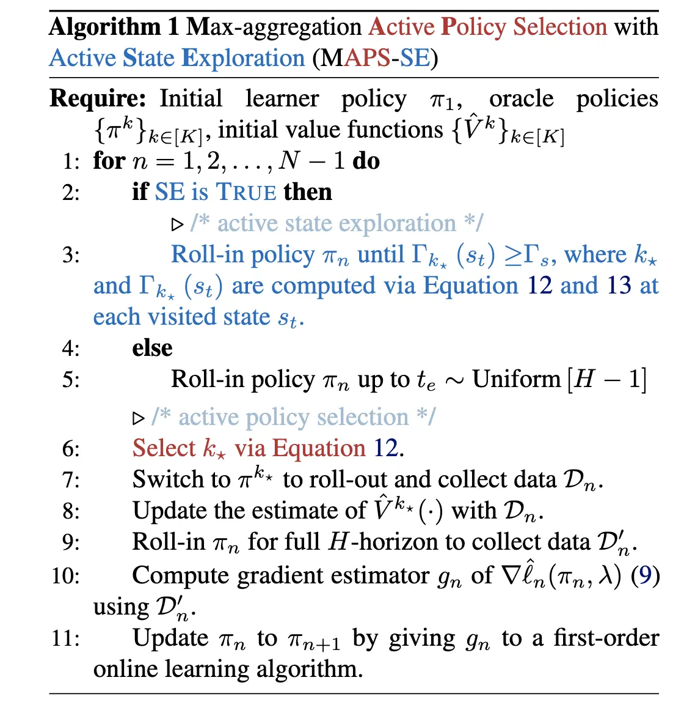

> [!abstract] Contributions
>
> 本文研究的是如何从多个次优黑盒 Oracle 中高效学习一个状态依赖/State-dependent 的策略。核心方法 MAPS（Max-aggregation Active Policy Selection）通过上置信界/Upper Confidence Bound/UCB 机制主动选择在当前状态下最有可能是最优的 Oracle 进行 Roll-out，从而高效逼近 Max-aggregation 基线价值函数 $f^{\max}(s)$。进一步提出的 MAPS-SE 在此基础上加入主动状态探索/Active State Exploration/ASE 组件，根据价值函数估计的不确定性决定是否在当前状态切换到 Oracle 进行探索，从而减少不必要的 Oracle 查询。理论分析表明，在离散状态空间下，MAPS 识别每个状态最优 Oracle 的样本复杂度为 $\mathcal{O}(K + \sum_i \frac{H^2}{\Delta_i^2} \log \frac{K}{\delta})$，相比 MAMBA 的均匀采样策略 $\mathcal{O}(\sum_i \frac{KH^2}{\Delta_i^2} \log \frac{K}{\delta})$ 在 Oracle 数量 $K$ 较大时有显著优势。实验在 DeepMind Control Suite 的四个连续控制任务上验证了 MAPS 和 MAPS-SE 相对于 MAMBA 等基线的性能优势和样本效率提升。
>
> 本文的理论分析集中在离散状态空间，连续状态空间下的保证依赖于价值函数近似器（即集成网络）的质量，缺乏严格的理论支撑。此外，MAPS-SE 中的不确定性阈值 $\Gamma_s$ 是一个需要调优的超参数，对环境有依赖性，论文本身也承认了这一局限。

## 1. Introduction

强化学习/Reinforcement Learning/RL 在机器人、游戏等复杂领域取得了显著成果，但其样本效率低下的问题限制了在交互成本高昂的现实场景中的应用。模仿学习/Imitation Learning/IL 通过利用专家演示来引导探索，大幅降低了试错成本。然而传统 IL 通常假设可以访问一个近似最优的专家，这一假设在实际中往往不成立——更常见的情况是，学习者面对的是多个次优的黑盒 Oracle，它们各自在不同状态下表现各异，没有任何一个在所有状态上都占优。

现有方法对此问题的处理存在明显不足。最直接的做法是选择整体表现最好的单个 Oracle 进行模仿，但这完全忽略了不同 Oracle 在不同状态下的互补优势。MAMBA 作为当时的 SOTA 方法，虽然支持从多个 Oracle 学习，但在两个关键环节上缺乏主动性：（1）Oracle 选择上采用均匀随机采样，浪费大量样本在质量较差的 Oracle 上；（2）状态探索上随机选择切换时间点，可能在学习者已经有足够置信度的状态上仍然进行不必要的 Oracle 查询。

本文的核心洞察是：将 Oracle 选择问题建模为一个多臂赌博机/Multi-armed Bandit 问题，利用 UCB 策略在探索（尝试不确定的 Oracle）和利用（选择当前估计最优的 Oracle）之间取得平衡。在此基础上，通过主动状态探索机制进一步控制何时需要查询 Oracle、何时可以继续使用学习者自身的策略，从而在保证价值函数估计精度的同时最大化样本效率。

## 2. Problem Setup

### 2.1 MDP and Basic Definitions

本文考虑有限时域马尔可夫决策过程/Markov Decision Process/MDP $\mathcal{M}_0 = \langle \mathcal{S}, \mathcal{A}, \mathcal{P}, r, H \rangle$，其中 $\mathcal{S}$ 为状态空间，$\mathcal{A}$ 为动作空间，$\mathcal{P}: \mathcal{S} \times \mathcal{A} \to \Delta(\mathcal{S})$ 为未知转移函数，$r: \mathcal{S} \times \mathcal{A} \to [0, 1]$ 为未知奖励函数，$H$ 为时域长度。策略 $\pi: \mathcal{S} \to \Delta(\mathcal{A})$ 将状态映射为动作分布。学习者拥有一组 $K$ 个黑盒 Oracle $\Pi = \{\pi^k\}_{k=1}^K$，总交互轮数为 $N$。

对给定函数 $f: \mathcal{S} \to \mathbb{R}$，定义广义 $Q$ 函数与广义优势函数/Advantage Function：

$$
Q^f(s, a) \doteq r(s, a) + \mathbb{E}_{s' \sim \mathcal{P}(\cdot \mid s, a)}[f(s')]
$$

$$
A^f(s, a) \doteq Q^f(s, a) - f(s) = r(s, a) + \mathbb{E}_{s' \sim \mathcal{P}(\cdot \mid s, a)}[f(s')] - f(s)
$$

当 $f = V^\pi$ 时，上式退化为标准的 $Q$ 函数和优势函数。策略 $\pi$ 在初始分布 $d_0$ 下的价值为

$$
V^\pi(d_0) \doteq \mathbb{E}_{s_0 \sim d_0} \left[ \mathbb{E}_{\tau_0 \sim \rho^\pi(\cdot \mid s_0)} \left[ \sum_{t=0}^{H-1} r(s_t, a_t) \right] \right],
$$

其中 $\rho^\pi(\tau_t \mid s_t)$ 为从 $s_t$ 出发按 $\pi$ 生成的轨迹分布。$d^\pi \doteq \frac{1}{H} \sum_{t=0}^{H-1} d_t^\pi$ 为策略 $\pi$ 的平均状态分布。

### 2.2 Policy Framework for Learning from Multiple Oracles

本文围绕三种逐步递进的策略展开讨论：

**Single-best Oracle $\pi^\star$**：事后最优基线，$\pi^\star \coloneqq \arg\max_{\pi \in \Pi} V^\pi(d_0)$。这是最简单的基线——选择整体回报最高的那一个 Oracle。但它完全没有利用不同 Oracle 在不同状态下各有所长的逐状态互补性。

**Max-following $\pi^\bullet$**：在每个状态独立选择当前价值最大的 Oracle：

$$
\pi^\bullet(a \mid s) \doteq \pi^{k^\star}(a \mid s), \quad k^\star \doteq \arg\max_{k \in [K]} V^k(s), \tag{1}
$$

其中 $V^k(s)$ 是第 $k$ 个 Oracle 在状态 $s$ 的价值函数。Max-following 是一种贪心策略：总是跟随当前状态下看起来最强的 Oracle。

**Max-aggregation $\pi^{\max}$**：在 Max-following 基础上进行一步策略改进/One-step Policy Improvement。定义基线价值函数

$$
f^{\max}(s) \doteq \max_{k \in [K]} V^k(s), \tag{2}
$$

则 Max-aggregation 策略为

$$
\pi^{\max}(a \mid s) \doteq \delta_{a=a^\star}, \quad a^\star \doteq \arg\max_{a \in \mathcal{A}} A^{f^{\max}}(s, a). \tag{3}
$$

这个策略不是简单地模仿某个 Oracle，而是利用所有 Oracle 的"价值包络"$f^{\max}$ 作为后继状态的价值估计，从而在当前状态选择使得 $Q^{f^{\max}}(s, a)$ 最大的动作。在单 Oracle 情况下，$\pi^{\max}$ 退化为标准的一步策略改进 $\pi_+^e$：

$$
\pi_+^e \doteq \arg\max_{a \in \mathcal{A}} r(s, a) + \mathbb{E}_{s' \sim \mathcal{P}(\cdot \mid s, a)}[V^{\pi^e}(s')], \tag{4}
$$

此时 $\pi^{\max}$ 保证不差于 $\pi^\bullet$（也即不差于 $\pi^e$ 本身）。在多 Oracle 情况下，$\pi^{\max}$ 与 $\pi^\bullet$ 一般不可直接比较，除非某个 Oracle 在所有状态均占优。

> [!tip] 直觉理解
> $f^{\max}(s)$ 构造了一个"最优价值包络"：在每个状态取所有 Oracle 价值的最大值。$\pi^{\max}$ 利用这个包络作为对后续状态价值的乐观估计来选择动作，这使得它能够在理论上超越任何单个 Oracle 的表现。
>
> 但是一般来讲这个 $f^{\max}(s)$ 一般不满足 Bellman 方程，不过一般满足 $f^{\max}(s)\le (T^* f^{\max})(s):= \max_a \Big[r(s,a)+\mathbb{E}_{s'}f^{\max}(s')\Big].$ 而我们的 $\pi^{\max}$ 是基于 $f^{\max}$ 的单步策略改进，而不是最终的最优策略。

### 2.3 Online Imitation Learning Loss and Policy Gradient

算法的关键在于高效估计 $f^{\max}(s)$。由于 Oracle 是黑盒的，无法直接获取其价值函数，本文沿用交互式模仿学习的思路，将问题规约为在线学习。具体而言，将每轮的状态分布 $d^{\pi_n}$（由当前策略 $\pi_n$ 诱导）视为对手选择的分布。这一对抗性视角的好处是：不需要假设数据分布固定，通过无悔/No-regret 在线学习算法即可保证策略的平均表现收敛。

第 $n$ 轮的 **在线模仿学习损失** 定义为：

$$
\ell_n^{\text{IL}}(\pi) \doteq -H \, \mathbb{E}_{s \sim d^{\pi_n}}[A^{f^{\max}}(s, \pi)]. \tag{5}
$$

为**平衡模仿学习与强化学习的效果**，本文引入混合损失：

$$
\ell_n(\pi; \lambda) \doteq \underbrace{-(1-\lambda) H \mathbb{E}_{s \sim d^{\pi_n}}[A_\lambda^{f^{\max}, \pi}(s, \pi)]}_{\text{Imitation Learning Loss}} \underbrace{- \lambda \mathbb{E}_{s \sim d_0}[A_\lambda^{f^{\max}, \pi}(s, \pi)]}_{\text{Reinforcement Learning Loss}}, \tag{6}
$$

其中 $\lambda \in [0, 1]$ 控制 IL 和 RL 的权重，$A_\lambda^{f^{\max}, \pi}(s, a)$ 是 $\lambda$-加权优势函数：

$$
A_\lambda^{f^{\max}, \pi}(s, a) \doteq (1-\lambda) \sum_{i=0}^{\infty} \lambda^i A_{(i)}^{f^{\max}, \pi}(s_t, a_t), \tag{7}
$$

$$
A_{(i)}^{f^{\max}, \pi}(s_t, a_t) \doteq \mathbb{E}_{\tau_i \sim \rho^\pi(\cdot \mid s_t)} \left[r(s_t, a_t) + \cdots + r(s_{t+i}, a_{t+i}) + f^{\max}(s_{t+i+1}) \right] - f^{\max}(s_t).
$$

这个 $\lambda$-加权优势函数混合了不同步长的优势估计：$\lambda = 0$ 时退化为单步优势（纯 IL），$\lambda \to 1$ 时趋向于完整回报（几乎为 RL，偏离当前的单步 Imitation）。

价值函数的估计通过 Roll-out 实现。对从状态 $s_t$ 出发、由第 $k$ 个 Oracle 生成的 $N_k(s_t)$ 条轨迹，估计其价值为：

$$
\hat{V}^k(s_t) \doteq \frac{1}{N_k(s_t)} \sum_{i=1}^{N_k(s_t)} \sum_{j}^{H} \lambda^j r(s_j, a_j). \tag{8}
$$

策略梯度估计为：

$$
\nabla \hat{\ell}_n(\pi_n; \lambda) = -H \mathbb{E}_{s \sim d^{\pi_n}, a \sim \pi_n(\cdot \mid s)} \left[ \nabla \log \pi_n(a \mid s) \hat{A}_\lambda^{f^{\max}, \pi_n}(s, a) \right]. \tag{9}
$$

> 注意，这个策略梯度估计并不是直接的求导，而是参考了 [Policy Improvement via Imitation of Multiple Oracles](./MAMBA.md) 里的结果设计的策略梯度估计。

### 2.4 Limitations of MAMBA

MAMBA 是本文的直接改进对象。其核心问题有二：

1. **均匀 Oracle 选择**：MAMBA 在每轮随机选择一个 Oracle 进行 Roll-out，不考虑哪个 Oracle 可能在当前状态更优。这导致大量样本被浪费在质量较差的 Oracle 上，$f^{\max}(s)$ 的估计收敛缓慢。
2. **随机状态切换**：MAMBA 随机选择时间步在学习者策略和 Oracle 之间切换，不考虑当前状态是否真正需要 Oracle 的信息。这可能导致在已有足够置信度的状态上浪费 Oracle 查询，或在高不确定性的状态上错失探索机会。

## 3. Algorithm

MAPS-SE 的完整算法由两个核心组件构成：主动策略选择/Active Policy Selection/APS 和主动状态探索/Active State Exploration/ASE。去掉 ASE 组件的简化版本称为 MAPS。

### 3.1 Active Policy Selection (MAPS)

MAPS 将"选择哪个 Oracle 进行 Roll-out"建模为多臂赌博机问题，用 UCB 策略在探索和利用之间取得平衡。

**离散状态空间**：对给定状态 $s_t$，选择最优 Oracle $k_\star$ 为

$$
k_\star = \operatorname*{\arg\max}_{k \in [K]} \hat{V}^k(s_t) + \sqrt{\frac{2H^2 \log \frac{2}{\delta}}{N_k(s_t)}}, \tag{10}
$$

其中 $\hat{V}^k(s_t)$ 是第 $k$ 个 Oracle 在 $s_t$ 的估计价值，$N_k(s_t)$ 是该 Oracle 在 $s_t$ 被 Roll-out 的次数，$\delta$ 为置信参数。UCB 项 $\sqrt{2H^2 \log(2/\delta) / N_k(s_t)}$ 捕捉了估计的不确信程度——被查询次数少的 Oracle 拥有更大的探索奖励。

**连续状态空间**：$N_k(s_t)$ 无法精确追踪，改用集成网络/Ensemble 来近似。对每个 Oracle $\pi^k$，训练 $n$ 个独立的价值预测网络，以其均值 $\hat{V}^k(s_t)$ 和标准差 $\sigma_k(s_t)$ 分别作为估计值和不确定性度量：

$$
k_\star = \operatorname*{\arg\max}_{k \in [K]} \hat{V}^k(s_t) + \sigma_k(s_t). \tag{11}
$$

两种情况统一表示为：

$$
k_\star = \operatorname*{\arg\max}_{k \in [K]} \begin{cases} \hat{V}^k(s_t) + \sqrt{\frac{2H^2 \log \frac{2}{\delta}}{N_k(s_t)}} & \text{discrete} \\ \hat{V}^k(s_t) + \sigma_k(s_t) & \text{continuous} \end{cases} \tag{12}
$$

与 MAMBA 的均匀选择策略相比，MAPS 的优势在于：它会迅速识别出在每个状态下表现较好的 Oracle，集中样本预算在这些 Oracle 上进行估计，而非均匀分配给所有 Oracle。在单 Oracle 情况下，MAPS 退化为 MAMBA。

### 3.2 Active State Exploration (MAPS-SE)

MAPS 解决了"选哪个 Oracle"的问题，但仍然在每个状态都进行 Oracle 查询。MAPS-SE 进一步引入 ASE 组件，决定"是否需要在当前状态查询 Oracle"。

核心思路是：定义选中 Oracle $k_\star$ 在状态 $s_t$ 的探索奖励/Exploration Bonus $\Gamma_{k_\star}(s_t)$：

$$
\Gamma_{k_\star}(s_t) = \begin{cases} \sqrt{\frac{2H^2 \log \frac{2}{\delta}}{N_{k_\star}(s_t)}} & \text{discrete} \\ \sigma_{k_\star}(s_t) & \text{continuous} \end{cases} \tag{13}
$$

同时设定不确定性阈值 $\Gamma_s$：

$$
\Gamma_s = \alpha \cdot \left( \sqrt{\frac{2H^2 \log \frac{2}{\delta}}{K + \left(\sum_i \frac{1}{\Delta_i^2}\right) \log\left(\frac{K}{\delta}\right)}} \right), \tag{14}
$$

其中 $\alpha$ 为可调超参数。

**决策逻辑**：在学习者策略 $\pi_n$ 的 Roll-in 阶段，逐状态检查 $\Gamma_{k_\star}(s_t) \geq \Gamma_s$ 是否成立：
- 若 $\Gamma_{k_\star}(s_t) \geq \Gamma_s$：当前状态的价值估计不确定性较高，切换到 Oracle $k_\star$ 进行 Roll-out，收集数据以改善估计。
- 若 $\Gamma_{k_\star}(s_t) < \Gamma_s$：当前状态的估计已足够可靠，继续使用学习者策略，不浪费 Oracle 查询。

> [!tip] 阈值的权衡
> $\Gamma_s$ 过大时，学习者几乎不会切换到 Oracle，导致价值估计 $\hat{V}^{k_\star}(s)$ 的不确定性居高不下，梯度估计偏差大。$\Gamma_s$ 过小时，学习者频繁切换到 Oracle，在已有充分置信度的状态上浪费样本。Theorem 4 给出了理论上合适的 $\Gamma_s$ 取值。

### 3.3 Full Algorithm Pipeline

> [!note] Algorithm 1: MAPS-SE
> **输入**：初始学习者策略 $\pi_1$，Oracle 集 $\{\pi^k\}_{k \in [K]}$，初始价值函数 $\{\hat{V}^k\}_{k \in [K]}$
>
> **for** $n = 1, 2, \ldots, N-1$ **do**
> 1. **if** ASE 启用 **then**
>    - Roll-in 学习者策略 $\pi_n$，在每个访问的状态 $s_t$ 计算 $k_\star$（Eq. 12）和 $\Gamma_{k_\star}(s_t)$（Eq. 13）
>    - 一旦 $\Gamma_{k_\star}(s_t) \geq \Gamma_s$，停止 Roll-in，记录当前状态为切换状态
> 2. **else**
>    - Roll-in 学习者策略 $\pi_n$ 至随机时间步 $t_e \sim \text{Uniform}[H-1]$
> 3. 用 UCB 选择最优 Oracle $k_\star$（Eq. 12）
> 4. 切换到 $\pi^{k_\star}$ 进行 Roll-out，收集数据 $\mathcal{D}_n$
> 5. 用 $\mathcal{D}_n$ 更新 $\hat{V}^{k_\star}(\cdot)$ 的估计
> 6. Roll-in $\pi_n$ 完整 $H$ 步，收集数据 $\mathcal{D}_n'$
> 7. 用 $\mathcal{D}_n'$ 计算梯度估计 $g_n$（Eq. 9）
> 8. 以 $g_n$ 更新 $\pi_n \to \pi_{n+1}$（一阶在线学习算法）

实现细节上，每个 Oracle 维护一个固定大小的缓冲区（$|\mathcal{D}_n| = 19{,}200$），满后丢弃最旧数据；学习者的数据缓冲区大小为 $|\mathcal{D}_n'| = 2{,}048$，满后清空并用于更新。策略更新采用 PPO 风格。

### 3.4 Theoretical Guarantees

在理解了算法的完整流程之后，本节分析 MAPS 和 MAPS-SE 的理论性质。分析集中在在线模仿学习损失 $\ell_n^{\text{IL}}(\cdot)$（即 $\lambda = 0$ 的情形），与 MAMBA 的理论框架一致。

#### 3.4.1 General Performance Bound

定义以下关键量：

- 在线算法遗憾/Regret：$\text{Regret}_N = \sum_{n=1}^N \ell_n^{\text{IL}}(\pi_n) - \min_{\pi \in \Pi} \sum_{n=1}^N \ell_n^{\text{IL}}(\pi)$
- Oracle 集质量度量：$\epsilon_N(\Pi) = \frac{1}{N} \min_{\pi \in \Pi} \left( \sum_{n=1}^N \ell_n^{\text{IL}}(\pi) - \sum_{n=1}^N \ell_n^{\text{IL}}(\pi^{\max}) \right)$
- 平均性能差距：$\zeta_N = -\frac{1}{N} \sum_{n=1}^N \ell_n^{\text{IL}}(\pi^{\max})$

> [!note] Theorem 1 (一般性能下界)
> 对 Algorithm 1 基于一阶在线学习算法产生的策略序列 $\{\pi_n\}$，有
>
> $$
> \mathbb{E}\left[\max_{n \in [N]} V^{\pi_n}(d_0)\right] \geq \mathbb{E}_{s \sim d_0}\left[\max_{k \in [K]} V^k(s)\right] + \mathbb{E}\left[\zeta_N - \epsilon_N(\Pi) - \frac{\text{Regret}_N}{N}\right].
> $$

这个定理说明学习算法的性能由三项决定：（1）$\zeta_N$ 反映 $\pi^{\max}$ 本身的质量（通常为正）；（2）$\epsilon_N(\Pi)$ 反映策略类的逼近误差；（3）$\text{Regret}_N / N$ 反映在线学习算法的收敛速度。要提升性能，关键是降低 Regret。

对满足 $\mathbb{E}[\text{Regret}_N] \leq O(\beta \cdot N + \sqrt{vN})$ 的一阶在线算法（其中 $\beta$ 为梯度估计偏差，$v$ 为方差），MAPS 和 MAPS-SE 的改进正是通过减小 $\beta$ 和 $v$ 来实现的。

#### 3.4.2 Advantage of MAPS over Uniform Sampling

> [!note] Theorem 2 (MAPS 的样本复杂度)
> 对任意状态 $s$ 和 $K$ 个 Oracle，使用主动策略选择的 Algorithm 1 以概率至少 $1 - \delta$ 识别出最优 Oracle，所需的状态访问次数为
>
> $$
> T = \mathcal{O}\left(K + \left(\sum_i \frac{H^2}{\Delta_i(s)^2}\right) \log\left(\frac{K}{\delta}\right)\right), \tag{16}
> $$
>
> 其中 $\Delta_i(s) \coloneqq V_{i^\star}(s) - V_i(s)$ 是 Oracle $i$ 在状态 $s$ 的次优性间隙/Suboptimality Gap，$i^\star = \arg\max_i V_i(s)$ 为该状态下的最优 Oracle。

> [!todo]- Theorem 2 证明思路
> 证明的核心是利用 UCB 的性质。定义事件 $E(s)$：对所有 Oracle $i$ 和所有时步 $t$，价值估计的误差不超过 $\frac{1}{5}\sqrt{a/t}$。由 Hoeffding 不等式和 Union Bound，$\mathbb{P}[E(s)] \geq 1 - 2TK\exp(-a/(50H^2))$。
>
> 在事件 $E(s)$ 下，证明分两步：
> 1. 对次优 Oracle $i \neq i^\star$，其被选择次数有上界 $N_i(t) \leq \frac{36a}{25\Delta_i^2} + 1$——因为一旦采样足够多次，其 UCB 值将低于最优 Oracle 的估计值。
> 2. 对最优 Oracle $i^\star$，其被选择次数的下界为 $N_{i^\star}(T) - 1 \geq T - K - \frac{36a}{25}\sum_{i \neq i^\star} \Delta_i^{-2}$。
>
> 令 $2TK\exp(-2a/(50H^2)) = \delta$ 并求解 $T$，即得结论。

> [!note] Theorem 3 (MAMBA 均匀采样的样本复杂度)
> 在相同条件下，均匀选择策略识别最优 Oracle 所需的状态访问次数为
>
> $$
> T = \mathcal{O}\left(\left(\sum_i \frac{KH^2}{\Delta_i(s)^2}\right) \log\left(\frac{K}{\delta}\right)\right). \tag{17}
> $$

两者的关键区别在于 Oracle 数量 $K$ 的影响。均匀采样的代价为 $\tilde{\mathcal{O}}(KH^2\log K)$，而 MAPS 仅需 $\tilde{\mathcal{O}}(K + H^2 \log K)$。当 $K$ 较大时，MAPS 的优势尤为显著——它避免了将等量样本浪费在已被判定为次优的 Oracle 上。

> [!todo]- Theorem 3 证明思路
> 均匀采样下每个 Oracle 被选中的概率均为 $1/K$，因此经过 $T$ 轮后每个 Oracle 被采样约 $\lfloor T/K \rfloor$ 次。由 Hoeffding 不等式，次优 Oracle $i$ 的估计值超过最优 Oracle 估计值的概率为 $\mathbb{P}[\hat{V}_{i,T_i}(s) - \hat{V}_{i^\star,T_{i^\star}}(s) \geq 0] \leq \exp\left(-\frac{T}{KH^2}\Delta_i^2\right)$。取 Union Bound 并令失败概率等于 $\delta$，求解即得 $T = \mathcal{O}\left(\left(\sum_i \frac{KH^2}{\Delta_i^2}\right)\log\frac{K}{\delta}\right)$。

#### 3.4.3 Stopping Criterion for MAPS-SE

> [!note] Theorem 4 (ASE 的停止条件)
> 对任意状态 $s$ 和 $K$ 个 Oracle，当探索奖励达到以下阈值时，MAPS-SE 以概率至少 $1 - \delta$ 识别出最优 Oracle：
>
> $$
> \Gamma_s = o\left(\sqrt{\frac{2H^2 \log \frac{4}{\delta}}{K + \left(\sum_i \frac{H^2}{\Delta_i^2}\right)\log\left(\frac{2K}{\delta}\right)}}\right). \tag{18}
> $$

Theorem 4 的意义在于：它指出 ASE 不会盲目地在所有状态上持续探索。一旦某个状态的不确定性降至阈值以下，就可以确信已识别出最优 Oracle，后续对该状态的访问将直接贡献于最优 Oracle 的价值估计——降低梯度估计的方差项 $v$。

> [!todo]- Theorem 4 证明思路
> 由 Theorem 2，在 $N(s) = \mathcal{O}(K + \sum_i \frac{H^2}{\Delta_i^2} \log \frac{K}{\delta})$ 次状态访问后，$f^{\max}(s)$ 不再选择次优 Oracle。由 Lemma D.1（Hoeffding 不等式的直接应用），要使估计不确定性达到 $\Gamma$，需要 $N_k(s_t) = \frac{2H^2 \log(2/\delta)}{\Gamma^2}$ 条轨迹。将两个条件联立求解 $\Gamma$，即得阈值的渐近表达式。

综合来看，MAPS 通过降低偏差项 $\beta$（更快识别最优 Oracle）改善了 Regret 上界的第一项，而 MAPS-SE 通过降低方差项 $v$（只在需要时查询 Oracle，且总是查询最优 Oracle）改善了第二项。

## 4. Experiments

### 4.1 Experiment Setup

**环境**：DeepMind Control Suite 中的四个连续状态-动作空间任务——Cheetah-run、Cartpole-swingup、Pendulum-swingup 和 Walker-walk。

**Oracle 构造**：对每个环境，用 PPO-GAE 和 SAC 预训练策略，定期保存检查点。每个任务使用三个 Oracle，来自不同训练阶段的检查点，质量逐步提升。这确保了 Oracle 之间存在差异且互补。

**基线**：(1) Best Oracle——事后最优的单个 Oracle；(2) PPO-GAE——纯 RL 基线；(3) MAMBA——多 Oracle 模仿学习 SOTA。所有方法的环境交互总量保持一致。

### 4.2 Performance of MAPS

<!-- TODO: insert Figure 2 from paper — MAPS vs baselines (MAMBA, PPO-GAE, best oracle) across four environments, best-return-so-far curves -->

MAPS 在 Cheetah-run、Cartpole-swingup 和 Pendulum-swingup 上均优于所有基线（包括 Best Oracle），且收敛更快。在 Walker-walk 上，MAPS 表现略逊，论文推测这是因为 Oracle 质量普遍较高而缓冲区大小有限，导致早期状态中的价值估计不够准确。

<!-- TODO: insert Figure 3 from paper — oracle selection frequency comparison between MAPS and MAMBA in Cheetah-run -->

Oracle 选择频率分析（Figure 3）直观展示了 MAPS 的主动性：MAPS 很快识别出好的 Oracle 并集中查询它，而 MAMBA 始终对好、中、差三个 Oracle 保持近乎均匀的选择频率。这与 Theorem 2 的理论预测一致——主动选择减少了在次优 Oracle 上的样本浪费。

### 4.3 Performance of MAPS-SE

<!-- TODO: insert Figure 4 from paper — Left: standard deviation at switch states; Right: MAPS-SE vs MAPS vs best oracle performance -->

MAPS-SE 在所有环境上均优于 MAPS（Figure 4 右），验证了 ASE 组件的有效性。Figure 4（左）展示了关键证据：在切换状态处，MAPS-SE 的预测价值标准差显著低于 MAPS 和 MAMBA。这说明 ASE 成功地将 Oracle 查询集中在了真正需要探索的高不确定性状态上。

MAMBA 和 MAPS 的切换状态标准差随训练呈上升趋势——因为随机选择切换时间点可能将 Oracle 暴露给不熟悉的状态。相比之下，MAPS-SE 的标准差保持在低水平，这直接减小了梯度估计的方差，从而改善性能。

### 4.4 Critical Analysis of Experiments

- **环境多样性不足**：仅在四个连续控制任务上测试，缺乏离散状态空间、高维观测（如图像输入）或更复杂任务（如多关节操控）的验证。理论分析在离散空间成立，但实验完全在连续空间进行，两者之间的对应关系依赖于集成网络的近似质量。
- **Oracle 构造方式单一**：所有 Oracle 来自同一算法（PPO-GAE / SAC）的不同训练阶段，缺乏来自不同算法或不同策略架构的 Oracle 组合。这使得 Oracle 之间的互补性模式可能过于规律。
- **Walker-walk 上的表现下降**：论文将其归因于缓冲区大小限制，但未进行消融实验验证此猜测。这提示 MAPS 对缓冲区大小等超参数可能较为敏感。
- **$\Gamma_s$ 的调优**：论文在实验中使用固定的 $\Gamma_s = 2.5$，但承认其对环境有依赖性，未提供系统的调优指导。

## 5. Related Work & Future Work

### Related Work

本文所处的研究位置是交互式模仿学习、主动模仿学习与多 Oracle 学习的交叉点。

**交互式模仿学习**：DAgger 开创了在线收集专家数据来纠正分布漂移的范式，AggreVaTe 引入了 cost-to-go 的概念，AggreVaTeD 进一步将其推广为可微分的策略梯度形式。但这些方法均假设单一近似最优专家，且不考虑查询成本。LEAQI 引入了主动决定是否查询专家的机制，但同样限于单 Oracle 设定。

**多 Oracle 学习**：EXP3、EXP4、Hedge 等方法将多专家学习建模为上下文赌博机或在线学习问题，但无法处理有状态转移的序贯决策。ILEED 根据专家在各状态的专长进行区分，但限于离线 IL。MAMBA 是最接近的先驱工作，支持在线多 Oracle IL + RL，但在 Oracle 选择和状态探索上缺乏主动性。MAPS 可以理解为 MAMBA 的"主动化"改进。

**策略选择**：A-OPS 等方法研究从候选策略集中选择最优策略，但通常假设存在可查询的最优策略、不支持将学习者策略纳入候选集、或限于无状态的在线学习。MAPS 的不同之处在于它同时进行策略选择和策略改进。

### Future Work

**论文明确提出的方向**：
> 论文提出的核心框架可以自然地扩展到更大规模的 Oracle 集合，以及更复杂的环境设定。

**从论文局限性自然延伸的可能方向**：

- 将理论分析扩展到连续状态空间，特别是建立集成网络不确定性估计与 UCB 探索奖励之间的正式联系。
- 自适应的 $\Gamma_s$ 选择机制，例如根据训练进度或全局不确定性水平自动调整阈值，减少超参数调优负担。
- 在更多样化的环境中验证，包括离散状态空间（与理论分析直接对应）、高维观测空间、以及来源更加异构的 Oracle 集合。
- 研究 Oracle 数量 $K$ 很大时的可扩展性问题——虽然理论上 MAPS 的样本复杂度对 $K$ 的依赖仅为加性的，但实践中维护 $K$ 个价值函数估计器的计算和存储开销可能成为瓶颈。
