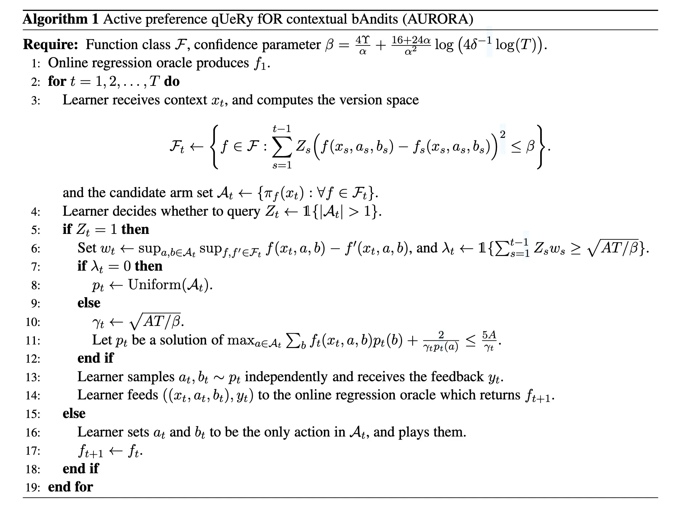

> [!abstract] Contributions

## 2. Related Work

## 3. Preliminaries

我们主要考虑两种设定：上下文老虎机/Contextual Bandits 设定和模仿学习/Imitation Learning 设定。

### 3.1 Contextual Bandits Setting 

Contextual Dueling Bandit 下，我们假设有一个 Context Set $\mathcal{X}$ 和一个动作空间 $\mathcal{A} = [A]$。在每一轮 $t \in [T]$ 中，环境会对抗性的/Adversarially 选择一个上下文 $x_t$，学习者的任务是**决定是否向专家发起查询**。如果决定查询，就**选择一个动作对 $(a_t, b_t) \in \mathcal{A} \times \mathcal{A}$**，随后会收到一个 **带噪声的反馈** $y_t \in \{-1, 1\}$，指示 $a_t$ 和 $b_t$ 哪个更好。

形式化来讲，我们假设专家依赖于一个偏好函数/Preference Function $f^\star: \mathcal{X} \times \mathcal{A} \times \mathcal{A} \to [-1, 1]$。基于这个偏好函数，其带噪声的反馈 $y_t$ 按照下述方式进行采样：

$$
\text{Pr}(a_t \succ b_t \mid x_t) = \text{Pr}(y_t = 1\mid x_t, a_t, b_t) = \phi(f^\star(x_t, a_t, b_t))
$$

其中 $\phi: [-1, 1] \to [0, 1]$ 是链接函数/Link Function，其满足 $\phi(-d) + \phi(d) = 1$。如果学习者不进行查询，它仍然需要选择一对动作，但是不受到任何反馈，$Z_t \in \{0, 1\}$ 指示学习者是否在第 $t$ 轮进行了查询。对于偏好函数，其一般要假设满足一定的关于序关系的性质：

**Assumption**：我们假设 $f^\star$ 在函数类 $\mathcal{F}$ 中，且函数类 $\mathcal{F}$ 中的所有函数都满足以下两个性质：传递性/Transitivity，对于任何上下文 $x\in \mathcal{X}$ 和动作 $a, b, c \in \mathcal{A}$，如果 $f(x, a, b) > 0$ 且 $f(x, b, c) > 0$，那么 $f(x, a, c) > 0$；反对称性/Anti-symmetry，对于任何上下文 $x \in \mathcal{X}$ 和动作 $a, b \in \mathcal{A}$，有 $f(x, a, b) = -f(x, b, a)$。

传递性意味着偏好是可以排序的,反对称性决定了偏好方向的一致性，即如果 $a$ 比 $b$ 好，那么 $b$ 一定比 $a$，这就避免了回环，因此最优摇臂一定存在。最优臂定义位对于任意 $f \in \mathcal{F}$ 和上下文 $x \in \mathcal{X}$，存在一个臂 $a \in \mathcal{A}$，使得对于任意臂 $b \in \mathcal{A}$ 都有 $f(x, a, b) \ge 0$。我们将这个最佳臂不失一般性地记为 $\pi_f(x) := a$。

我们直接可以将偏好函数 $f^\star$ 建模为奖励差值的形式：假设存在一个奖励函数 $r^\star: \mathcal{X} \times \mathcal{A} \to [0, 1]$，我们直接定义 $f^\star(x, a, b) = r^\star(x, a) - r^\star(x, b)$。在这种情况下，通常会选择 $\phi(d) = 1/(1 + \exp(-d))$，这对应了 Bradley-Terry-Luce/BTL 模型，在实践中这样的模型用于学习奖励模型。

对于上下文老虎机设定，学习者的目标是最小化遗憾/Regret 和查询次数/Queries，定义如下：

$$
\mathrm{Regret}_T^{\mathrm{CB}} \coloneqq \sum_{t=1}^T \left( f^\star(x_t, \pi_{f^\star}(x_t), a_t) + f^\star(x_t, \pi_{f^\star}(x_t), b_t) \right), \quad \mathrm{Queries}_T^{\mathrm{CB}} \coloneqq \sum_{t=1}^T Z_t.
$$

### 3.2 Imitation Learning Setting

Imitation Learning 设定中，我们考虑一个有限视界/Finite-Horizon 的 MDP，由元组 $M(\mathcal{X}, \mathcal{A}, r, P, H)$ 定义，其中 $\mathcal{X}$ 是状态空间，$\mathcal{A}$ 是动作空间，$P$ 是转移函数，$r: \mathcal{X} \times \mathcal{A} \to [0, 1]$ 是奖励函数，$H$ 是每一集的长度。

交互过程如下面所述：在每一集 $t \in [T]$ 开始时，学习者接收到一个初始状态 $x_{t,0}$（这也可以是对抗的）。然后，学习者与环境交互 $H$ 步。在每一步 $h$，学习者首先决定是否进行查询。如果进行查询，学习者需要选择一对动作 $(a_{t,h}, b_{t,h}) \in \mathcal{A} \times \mathcal{A}$，随后会收到一个反馈 $y_{t,h} \in \{-1, 1\}$，指示从专家角度看哪个动作更优。这里的反馈采样自：

$$
\text{Pr}(a_{t,h} \succ b_{t,h} \mid x_{t,h}, h) = \text{Pr}(y_{t,h} = 1 \mid x_{t,h}, a_{t,h}, b_{t,h}, h) = \phi(f^\star_h(x_{t,h}, a_{t,h}, b_{t,h})).
$$

剩余基本上和在 Contextual Bandits 设定中一样，无论学习者是否进行了查询，它随后都会从 $a_{t,h}, b_{t,h}$ 选择一个动作并转移，在 $H$ 步之后，下一集开始。$Z_{t,h} \in \{0, 1\}$ 指示学习者是否决定在第 $t$ 集的第 $h$ 步进行查询。我们假设函数空间 $\mathcal{F}$ 是 $H$ 个类的乘积，即 $\mathcal{F} = \mathcal{F}_0 \times \dots \times \mathcal{F}_{H-1}$，其中对于每个 $h$，我们使用 $\mathcal{F}_h = \{f: \mathcal{X} \times \mathcal{A} \times \mathcal{A} \to [-1, 1]\}$ 来建模 $f^\star_h$，并假设 $\mathcal{F}_h$ 满足传递性和反对称性假设。

策略/Policy 是一个映射 $\pi: \mathcal{X} \to \Delta(\mathcal{A})$。对应定义价值函数和动作价值函数。在模仿学习设定下，我们假设专家具有一个马尔可夫策略/Markov Policy $\pi_e$，并且专家的偏好依赖于 $\pi_e$ 下的后续累积奖励/Reward-to-Go 来决定偏好，形式化讲就是 $f^\star_h(x, a, b) = Q^{\pi_e}_h(x, a) - Q^{\pi_e}_h(x, b)$。因此，学习者的目标仍然是最小化遗憾和查询次数：

$$
\mathrm{Regret}_T^{\mathrm{IL}} \coloneqq \sum_{t=1}^T \left( V^{\pi_e}_0(x_{t,0}) - V^{\pi_t}_0(x_{t,0}) \right), \quad \mathrm{Queries}_T^{\mathrm{IL}} \coloneqq \sum_{t=1}^T \sum_{h=0}^{H-1} Z_{t,h}.
$$

### 3.3 Link Function and Online Regression Oracle

我们一般假设 $\phi$ 是某个 $\alpha$-强凸函数 $\Phi: [-1, 1] \to \mathbb{R}$ 的导数，并将相关联的损失函数定义为 $\ell_\phi(d, y) = \Phi(d) - d(y+1)/2$。此外，我们的算法利用了一个**在线回归预言机/Online Regression Oracle**，在线地输出一个函数 $f_t \in \mathcal{F}$，对于任意数据序列在 $\mathcal{F}$ 上具有次线性的遗憾保证：

**Assumption**：我们假设学习者可以使用一个 Online Regression Oracle，对于任意序列 $\{(x_1, a_1, b_1, y_1), \dots, (x_T, a_T, b_T, y_T)\}$，这里序列每一项的标签 $y_t$ 生成自 $y_t \sim \phi(f^*(x_t, a_t, b_t))$，我们有：

$$
\sum_{t=1}^T \ell_\phi \left( f_t(x_t, a_t, b_t), y_t \right) - \inf_{f \in \mathcal{F}} \ell_\phi \left( f(x_t, a_t, b_t), y_t \right) \le \Upsilon(\mathcal{F}, T)
$$

这里的上界 $\Upsilon(\mathcal{F}, T)$ 相对于 $T$ 次线性增长。若上下文清晰，我们定义 $\Upsilon := \Upsilon(\mathcal{F}, T)$。这里的 $\Upsilon$ 代表遗憾上界，在许多情况下通常是 $T$ 或函数类 $\mathcal{F}$ 复杂度/大小的对数阶。

要理解这里的设计，我们需要先了解算法的机制：算法大致流程是在每一轮 $t$ 之前都可以得到一个偏好函数 $f_t$，然后基于这个函数计算出版本空间/Version Space $\mathcal F_t$ 与候选摇臂集/Set of Candidate Arms $\mathcal A_t$，随后基于这些集合来计算不确定度及其阈值，从而决定是否进行查询。在决定查询之后，才可以获得该轮的反馈 $y_t$，并将 $(x_t, a_t, b_t, y_t)$ 添加到数据集中，进而根据 Oracle 来得到新一轮的偏好函数 $f_{t+1}$。

因此，Oracle 需要设计为**在线地**最小化某种回归损失，而不是朴素的经验风险最小化，其遗憾是相对于整个在线学习过程的，计算每一轮老的偏好函数 $f_t$ 在新数据点 $(x_t, a_t, b_t, y_t)$ 上的损失，进而拥有根据数据迭代和预测未来的能力。这样的设计使得算法和理论均模块化，

## 4. Algorithm on Contextual Dueling Bandits

AROURA 算法原为 Active Preference Query for Contextual Bandits 算法，在每一轮 $t\in [T]$ 中

<!-- 

我们首先提出针对上下文决斗老虎机（Contextual Dueling Bandits）的算法，命名为 **AURORA**（**A**ctive preference q**U**e**R**y f**OR** contextu**A**l b**A**ndits，意为：面向上下文老虎机的偏好主动查询），如 **算法 1** 所示。

在每一轮 $t \in [T]$，在线回归预言机（Online Regression Oracle）输出一个预测器 $f_t$。学习者利用这个预测器构建一个 **版本空间 (Version Space)** $\mathcal{F}_t$，该空间包含了所有在观测数据上与过去预测器表现相近的函数。这里，阈值 $\beta$ 被设定为 $4\Upsilon/\alpha + (16 + 24\alpha) \log (4\delta^{-1} \log(T))/\alpha^2$，以确保以至少 $1 - \delta$ 的概率满足 $f^\star \in \mathcal{F}_t$ 对所有 $t \in [T]$ 成立（引理 9）。因此，$\mathcal{A}_t$ 对于所有 $t \in [T]$ 都是非空的，相应的第 16 行定义也是良好的。

接着，学习者形成一个 **候选臂集 (Candidate Arm Set)** $\mathcal{A}_t$，该集合由版本空间中所有函数所导出的贪婪最优臂组成。
*   当 $|\mathcal{A}_t| = 1$ 时，集合中唯一的臂就是最优臂（因为 $f^\star \in \mathcal{F}_t$），因此**不需要查询** ($Z_t = 0$)。
*   然而，当 $|\mathcal{A}_t| > 1$ 时，$\mathcal{A}_t$ 中的任何臂都有可能是最优臂，因此学习者需要进行比较查询以获取更多信息。

接下来，我们将解释学习者进行查询的策略。
1.  首先，学习者计算 $w_t$，它代表了版本空间的“宽度 (width)”。具体来说，$w_t$ 是对播放 $\mathcal{A}_t$ 中任意臂所产生的**瞬时遗憾 (instantaneous regret) 的高估**（引理 8）。
2.  然后，学习者定义 $\lambda_t$，用于指示估计的累积遗憾 $\sum_{s=1}^{t-1} Z_s w_s$ 是否已经超过了 $\sqrt{AT / \beta}$。注意 $Z_t$ 被乘在 $w_t$ 上，因为当 $Z_t = 0$ 时不会产生遗憾。

针对 $\lambda_t$ 的不同取值，选择动作（用于查询）的策略如下：

---

**算法 1：面向上下文老虎机的偏好主动查询 (AURORA)**

**输入：** 函数类 $\mathcal{F}$，置信参数 $\beta = \frac{4\Upsilon}{\alpha} + \frac{16+24\alpha}{\alpha^2} \log (4\delta^{-1} \log(T))$。
1.  在线回归预言机生成 $f_1$。
2.  **for** $t = 1, 2, \dots, T$ **do**
3.  学习者接收上下文 $x_t$，并计算版本空间：
    $$
    \mathcal{F}_t \leftarrow \left\{ f \in \mathcal{F} : \sum_{s=1}^{t-1} Z_s \big( f(x_s, a_s, b_s) - f_s(x_s, a_s, b_s) \big)^2 \le \beta \right\}.
    $$
    以及候选臂集 $\mathcal{A}_t \leftarrow \{ \pi_f(x_t) : \forall f \in \mathcal{F}_t \}$。
4.  学习者决定是否查询：$Z_t \leftarrow \mathbb{1}\{|\mathcal{A}_t| > 1\}$。
5.  **if** $Z_t = 1$ **then**
6.      设定 $w_t \leftarrow \sup_{a,b \in \mathcal{A}_t} \sup_{f, f' \in \mathcal{F}_t} f(x_t, a, b) - f'(x_t, a, b)$，以及 $\lambda_t \leftarrow \mathbb{1}\{ \sum_{s=1}^{t-1} Z_s w_s \ge \sqrt{AT/\beta} \}$。
7.      **if** $\lambda_t = 0$ **then**
8.          $p_t \leftarrow \text{Uniform}(\mathcal{A}_t)$。
9.      **else**
10.         $\gamma_t \leftarrow \sqrt{AT/\beta}$。
11.         令 $p_t$ 为以下方程的解：$\max_{a \in \mathcal{A}_t} \sum_b f_t(x_t, a, b)p_t(b) + \frac{2}{\gamma_t p_t(a)} \le \frac{5A}{\gamma_t}$。
12.     **end if**
13.     学习者独立采样 $a_t, b_t \sim p_t$，并接收反馈 $y_t$。
14.     学习者将 $((x_t, a_t, b_t), y_t)$ 反馈给在线回归预言机，后者返回 $f_{t+1}$。
15. **else**
16.     学习者将 $a_t$ 和 $b_t$ 设为 $\mathcal{A}_t$ 中唯一的动作，并执行它们。
17.     $f_{t+1} \leftarrow f_t$。
18. **end if**
19. **end for**

---

*   如果 $\lambda_t = 0$，累积遗憾尚未超过 $\sqrt{AT / \beta} = O(\sqrt{T})$，因此学习者将通过从 $\mathcal{A}_t$ 中**均匀采样**来进行尽可能多的探索。
*   如果 $\lambda_t = 1$，遗憾可能已经达到了 $O(\sqrt{T})$，因此学习者采用一种类似于 **Inverse Gap Weighting (IGW)** 的技术（受 Saha and Krishnamurthy (2022) 启发），以在探索和利用之间取得更好的平衡。具体来说，学习者求解第 11 行中的凸规划问题，该问题是可行的且其解 $p_t$ 满足（见引理 11）：
    $$
    \mathbb{E}_{a \sim p_t} \left[ f^\star(x_t, \pi_{f^\star}(x), a) \right] = O \left( \gamma_t \mathbb{E}_{a, b \sim p_t} \left[ \big( f_t(x_t, a, b) - f^\star(x_t, a, b) \big)^2 \right] + \frac{A}{\gamma_t} \right). \quad (1)
    $$

由于上述关系，我们注意到可以将瞬时遗憾转化为预测器 $f_t$ 与真实值 $f^\star$ 之间的点式误差（point-wise error）加上一个额外的项 $A/\gamma_t$。这允许我们通过在线回归预言机的遗憾来界定累积点式误差。在特殊情况下，当存在一个“奖励函数” $r: \mathcal{X} \times \mathcal{A} \to [0, 1]$ 使得 $f(x, a, b) = r(x, a) - r(x, b)$（例 1）时，解 $p_t$ 可以直接写为：
$$
p_t(a) = \begin{cases} \frac{1}{A + \gamma_t (r_t(x_t, \pi_{f_t}(x_t)) - r_t(x_t, a))} & a \neq \pi_{f_t}(x_t) \\ 1 - \sum_{a' \neq \pi_{f_t}(x_t)} p_t(a') & a = \pi_{f_t}(x_t) \end{cases},
$$
其中 $r_t$ 是与 $f_t$ 关联的奖励函数。这是标准的 IGW 探索策略 (Foster and Rakhlin, 2020)，并导致与 (1) 相同的保证（见引理 12）。

> **【译者注 3.1】核心设计解读**
> *   **Version Space ($\mathcal{F}_t$):** 这是所有“看起来合理”的偏好模型的集合。如果一个模型在历史数据上预测误差太大，就被踢出这个集合。
> *   **$\lambda_t$ 的切换机制:** 这是算法的灵魂。
>     *   **早期 ($\lambda_t=0$):** 此时我们还没犯多少错，所以大胆探索（均匀采样），目的是快速缩小 Version Space。
>     *   **后期 ($\lambda_t=1$):** 此时累积错误已经很多了，必须谨慎。IGW 策略会给那些看起来“差得很远”的动作极小的概率，只在看起来不错的动作间探索。这保证了最坏情况下的 Regret 也是 $\sqrt{T}$ 级别的。
> *   **Active Query ($Z_t$):** 只有当 $\mathcal{A}_t$（候选最优动作集）里不止一个动作时才查询。这极大地节省了查询预算。

---

#### 3.1 理论分析 (Theoretical Analysis)

为了给出算法 1 的理论保证，我们采用了两个量来刻画上下文老虎机实例：均匀间隔（uniform gap）和 Eluder 维度（eluder dimension），介绍如下。

**假设 3 (均匀间隔 Uniform gap).** 我们假设由 $f^\star$ 在任意上下文 $x \in \mathcal{X}$ 下导出的最优臂 $\pi_{f^\star}(x)$ 是唯一的。此外，我们假设存在均匀间隔 $\Delta := \inf_{x} \inf_{a \neq \pi_{f^\star}(x)} f^\star(x, \pi_{f^\star}(x), a) > 0$。

我们注意到，均匀间隔的存在是上下文老虎机文献中的标准假设 (Dani et al., 2008; Abbasi-Yadkori et al., 2011; ...)。接下来，我们介绍 Eluder 维度 (Russo and Van Roy, 2013)，首先定义“$\epsilon$-依赖性”。

**定义 1 ($\epsilon$-依赖性 $\epsilon$-dependence).** 令 $\mathcal{G} \subseteq \mathcal{X} \to \mathbb{R}$ 为任意函数类。如果不等式 $\sum_{i=1}^n (g(x_i) - g'(x_i))^2 \le \epsilon^2$ 意味着 $g(x) - g'(x) \le \epsilon$ 对于任意一对满足条件的函数 $g, g' \in \mathcal{G}$ 成立，我们称元素 $x \in \mathcal{X}$ 关于 $\mathcal{G}$ **$\epsilon$-依赖于** $\{x_1, x_2, \dots, x_n\} \subseteq \mathcal{X}$。否则，我们称 $x$ **$\epsilon$-独立于** $\{x_1, x_2, \dots, x_n\}$。

**定义 2 (Eluder 维度 Eluder dimension).** 函数类 $\mathcal{G} \subseteq \mathcal{X} \to \mathbb{R}$ 的 $\epsilon$-Eluder 维度，记为 $\text{dim}_E(\mathcal{G}, \epsilon)$，是指 $\mathcal{X}$ 中最长序列的长度 $d$，该序列满足：存在某个 $\epsilon' \ge \epsilon$，使得序列中的每个元素都 **$\epsilon'$-独立于** 它的前驱元素。

Eluder 维度是函数类的标准复杂度度量，广泛用于老虎机和强化学习文献中。Eluder 维度较小的例子包括线性函数、广义线性模型和再生核希尔伯特空间 (RKHS) 中的函数。

给定这些量，我们要陈述我们的主要结果。证明在附录 B 中提供。

**定理 1 (Theorem 1).** 在假设 1 到 3 下，算法 1 保证以下的遗憾上界和查询次数上界：
$$
\text{Regret}_T^{\text{CB}} = \tilde{O} \left( \min \left\{ \sqrt{AT\beta}, \frac{A^2 \beta^2 \text{dim}_E(\mathcal{F}, \Delta)}{\Delta} \right\} \right),
$$
$$
\text{Queries}_T^{\text{CB}} = \tilde{O} \left( \min \left\{ T, \frac{A^3 \beta^3 \text{dim}_E^2(\mathcal{F}, \Delta)}{\Delta^2} \right\} \right)
$$
概率至少为 $1 - \delta$。我们回顾 $\beta = O(\alpha^{-1}\Upsilon + \alpha^{-2} \log(\delta^{-1} \log(T)))$，$\alpha$ 表示 $\Phi$ 的强凸系数。为了简洁，我们在上界中隐藏了对数项。

当损失 $\ell_\phi$ 是平方损失或逻辑损失（例 2 和 3）时，参数 $\beta$ 是 $T$ 的对数级。在这些情况下，忽略 $A$ 和对数项，遗憾为 $\tilde{O}(\min\{\sqrt{T}, \text{dim}_E(\mathcal{F}, \Delta)/\Delta\})$，查询次数为 $\tilde{O}(\min\{T, \text{dim}_E^2(\mathcal{F}, \Delta)/\Delta^2\})$。两者都由两部分组成：最坏情况上界和实例依赖上界。最坏情况界在所有情况下提供保证，而实例依赖界在底层问题表现良好（即具有小的 Eluder 维度和大的 Gap）时可以显著改善上界。

> **【译者注 3.2】定理 1 的意义**
> *   **Best-of-both-worlds:** 这是一个非常漂亮的界。
>     *   如果问题很难（$\Delta \approx 0$），退化为 $\sqrt{T}$，这和标准 Bandits 一样，没有损失。
>     *   如果问题很容易（$\Delta$ 很大），Regret 和 Query Complexity 都变成**常数**（相对于 $T$ 而言）。这证明了主动学习在偏好反馈下的巨大威力——你只需要问有限次，就能学得很好。

**证明直觉 (Intuition of proofs).** 我们接下来提供为什么我们的算法具有上述理论保证的直觉。首先，我们观察到从 $\lambda_t$ 的定义来看，指示器内的左侧项是非递减的，这允许我们将回合分为两个阶段。
*   在第一阶段，$\lambda_t$ 始终为 0，然后在某一点变为 1 并保持为 1。意识到这一点后，我们首先解释最坏情况遗憾的直觉。在第一阶段，由于 $w_t$ 是瞬时遗憾的高估（见引理 8），此阶段的累积遗憾不能超过 $O(\sqrt{T})$。
*   在第二阶段，我们将 IGW 的分析调整到此场景中，以获得 $O(\sqrt{T})$ 的上界。类似的技术已在 Saha and Krishnamurthy (2022); Foster et al. (2021) 中使用。由于两个阶段的遗憾都至多为 $O(\sqrt{T})$，总遗憾不能超过 $O(\sqrt{T})$。
*   接下来，我们解释实例依赖遗憾的直觉。由于均匀间隔 $\Delta$ 的存在，我们可以首先证明只要 $|\mathcal{A}_t| > 1$，我们必须有 $w_t \ge \Delta$（见引理 7）。这意味着对于所有可能产生遗憾的回合，相应的宽度至少为 $\Delta$。然而，这种情况发生的次数不可能太多，因为这个频率受到 Eluder 维度的限制，从而导致了实例依赖的遗憾上界。利用类似的技术，我们也可以获得查询次数的上界。

**与 MINMAXDB (Saha and Krishnamurthy, 2022) 的比较。** 在这项先前的工作中，作者假设 $\text{Pr}(y=1 \mid x, a, b) = (f^\star(x, a, b) + 1)/2$，这是我们反馈模型的一个特例（例 2）。虽然我们的最坏情况遗憾界与他们的相匹配，但我们的论文通过增加依赖于 Eluder 维度和 Gap 的实例依赖遗憾界改进了他们的结果。此外，我们还提供了查询复杂度的界，对于良态实例这可能很小，而 MINMAXDB 只是在每一轮都进行查询。

**与 ADACB (Foster et al., 2021) 的比较。** 我们的方法与 Foster et al. (2021) 有一些相似之处，特别是在理论结果方面，但在两个方面有所不同：(1) 他们假设标准的上下文老虎机，学习者直接观察奖励，而我们假设偏好反馈；(2) 他们假设随机设定，上下文是独立同分布（i.i.d.）抽取的，但我们假设上下文是对抗性选择的。虽然这两个设定可能无法直接比较，但应注意 Foster et al. (2021) 的目标不是最小化查询复杂度。

**下界 (Lower bounds).** 为了理解我们的算法是否达到了紧的上界，我们提供了以下下界，该下界源于从常规多臂老虎机到上下文决斗老虎机的归约（reduction）。

**定理 2 (下界 Lower bounds).** 以下两个主张成立：
(1) 对于任何算法，存在一个实例导致 $\text{Regret}_T^{\text{CB}} = \Omega(\sqrt{AT})$;
(2) 对于任何实现最坏情况期望遗憾上界为 $\mathbb{E}[\text{Regret}_T^{\text{CB}}] = O(\sqrt{AT})$ 的算法，存在一个具有 Gap $\Delta = \sqrt{A/T}$ 的实例，导致 $\mathbb{E}[\text{Regret}_T^{\text{CB}}] = \Omega(A/\Delta)$ 且 $\mathbb{E}[\text{Queries}_T^{\text{CB}}] = \Omega(A/\Delta^2) = \Omega(T)$。

通过将这些下界与定理 1 联系起来，我们得出结论：我们的算法在遗憾和查询复杂度上都达到了对 Gap $\Delta$ 和 $T$ 的紧依赖（在对数因子范围内）。此外，作为一个额外的贡献，我们在 B.4.1 节中建立了一个基于遗憾极限（limit of regret）而非定理 2 中假设的最坏情况遗憾的替代下界。

**无均匀间隔假设的结果。** 我们强调，定理 1 可以自然地扩展到不存在均匀间隔（即不满足假设 3）的场景，而无需对算法进行任何修改。结果陈述如下，与定理 1 类似。

**定理 3 (Theorem 3).** 在假设 1 和 2 下，算法 1 保证以下的遗憾上界和查询次数上界：
$$
\text{Regret}_T^{\text{CB}} = \tilde{O} \left( \min \left\{ \sqrt{AT \beta}, \min_{\epsilon > 0} \left\{ T_\epsilon \beta + \frac{A^2 \beta^2 \text{dim}_E(\mathcal{F}, \epsilon)}{\epsilon} \right\} \right\} \right),
$$
$$
\text{Queries}_T^{\text{CB}} = \tilde{O} \left( \min \left\{ T, \min_{\epsilon > 0} \left\{ T_\epsilon^2 \beta / A + \frac{A^3 \beta^3 \text{dim}_E^2(\mathcal{F}, \epsilon)}{\epsilon^2} \right\} \right\} \right)
$$
概率至少为 $1 - \delta$。这里我们将上下文 $x$ 的 Gap 定义为 $\text{Gap}(x) := \min_{a \neq \pi_{f^\star}(x)} f^\star(x, \pi_{f^\star}(x), a)$，并将上下文具有小 Gap 的回合数定义为 $T_\epsilon := \sum_{t=1}^T \mathbb{1}\{\text{Gap}(x_t) \le \epsilon\}$。

与定理 1 相比，上述结果有一个额外的 Gap 依赖项 $T_\epsilon$。这里 $\epsilon$ 表示 Gap 阈值，$T_\epsilon$ 衡量了多少次上下文落入了小 Gap 区域。我们强调，在某些条件如 Tsybakov 噪声条件 (Tsybakov, 2004) 下，$T_\epsilon$ 是很小的。还值得一提的是，我们的算法对 $\epsilon$ 是不可知的（agnostic），从而允许我们取所有 $\epsilon > 0$ 的最小值。

**与 SAGE-BANDIT (Sekhari et al., 2023) 的比较。** 定理 3 与 Sekhari et al. (2023) 中的定理 4 相似，后者研究了具有标准奖励信号（0-1 奖励）的上下文老虎机中的主动查询。值得注意的是，虽然我们的结果在因子 $A$（动作数量）方面看起来稍差，我们认为这种劣势是合理的，因为我们的方法需要两个动作来形成一个查询，从而在分析上将动作空间扩展到了 $\mathcal{A}^2$。这种依赖性是否可以改进仍然是未来研究的一个问题。 -->
