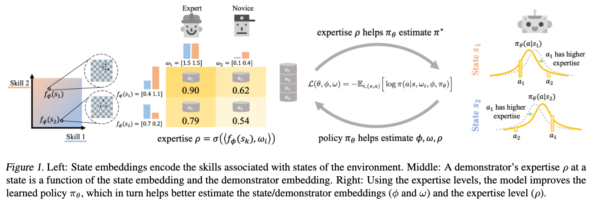
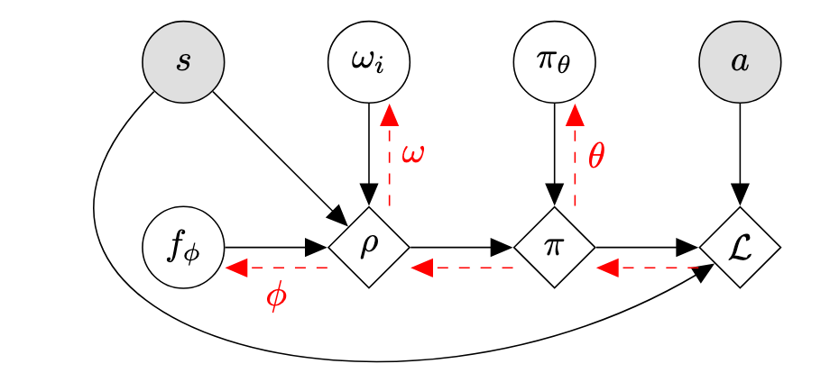

> [!abstract]
> 本文针对离线模仿学习中常见的众包数据质量参差不齐这一痛点，提出了一种名为 ILEED 的算法。在无法获取环境交互奖励且缺乏示范者专业度先验标签的设定下，传统行为克隆（BC）方法因盲目模仿次优行为而表现受限。本文的核心思想是将示范者的专业度视为状态的函数，通过无监督的方式显式建模每个示范者在特定状态下的次优程度。
>
> 技术层面上，ILEED 构建了一个基于最大似然估计的概率生成框架，联合优化潜在的最优策略、状态嵌入以及示范者嵌入。模型通过计算状态与示范者嵌入的内积来评估当前状态下的专业度，并据此调整动作分布的方差（连续空间）或随机性（离散空间），从而解释观测数据的次优性。理论分析证明，ILEED 是行为克隆的推广形式，并且在状态嵌入满足线性相关性等特定条件下，能够从混合质量的数据中唯一地识别并恢复出真值最优策略，有效解决了从异构示范中提取最优行为的难题。

## 1. Introduction

强化学习针对用户指定的奖励函数优化行为，然而强化学习需要与环境进行不断交互，与环境进行在线交互可能代价高昂、时间效率低甚至存在安全风险，并且设计合适的奖励函数本身也非常困难。我们可以使用离线学习的视角来处理该问题：在这种设定下，模型要么像**离线强化学习**那样，可以获得带有对应奖励值的任务示范数据，要么像**模仿学习**那样，只能获得不含任何奖励信息的专家示范。我们聚焦于模仿学习设定，模型只能获得示范数据。

离线方法能否成功，在很大程度上取决于是否有一个规模足够大且多样性丰富的数据集，因此需要有很多工作致力于在各个领域收集海量专家示范。然而，为了兼顾数据规模与多样性，往往需要采用众包式/Crowd-sourced 的数据采集方式。这种众包式数据手机流水线不可避免的会产生一个由**不同专业水平**的用户行为组成的多样化数据集。然而当前的模仿学习算法一般将这些数据集视为同质的，也就是假设所有示范都是同样最优的，这样可能会盲目地从次优示范者的弱点中学习。

本文提出这样的问题：是否可以使用这样一个事实，即轨迹来自具有不同次优程度的示范者，来改进学习过程？一个关键观点是：模仿学习框架应该利用示范者的身份信息来考虑示范者次优程度的差异。当我们对下棋进行学习的时候，我们显然应该认真对待那些水平极高的大师的示范，而忽略新手的示范。尽管我们事先并不知道各个棋手的专业度，但我们可以依靠“哪位棋手下了哪些棋”这一信息，在无监督的方式下估计他们的专业度，然后这些估计出的专业度就可以用来更有效地学习一个下棋策略。

本文提出 ILEED/Imitation Learning by Estimating Expertise of Demonstrators 算法，致力于在完全不依赖任何先验专业度信息的前提下，显式建模不同示范者的次优性，从而改进模仿学习过程。其对一个待学习策略与示范者的专业水平进行联合优化，不仅为每个示范者恢复出一个专业度标量，而且可以得到一个随状态变化的专业度值，用以刻画在具体状态下哪些示范者更擅长做出决策。如果次优示范和模型的生成过程一致，那么该方法可以通过极大似然估计恢复出最优策略。

在下面两个章节，我们将描述这个联合模型，从一个具有不同但是未知专业度水平的示范者所给出的混合示范数据集中进行学习，我们的模型既会推断数据集中不同示范者在不同状态下的专业度水平，也会从所有示范中恢复出一个单一的策略。

## 2. Problem Setup

> [!tip]
> 
> 本节指出如何使用数学语言描述不同的 Demonstrator 在不同的情况下水平不同的现象。

**Dataset**：从每一个示范者收集一组轨迹集合 $\mathcal{D}_i$，其中轨迹形为 $\tau = (s_0, a_0, \dots, s_t, a_t)$，长度可以不同，这里每一条轨迹都是从示范者 $i$ 的某个固定潜在策略 $\pi_i$ 中采样得到的。完整的数据集记为 $\mathcal{D} = \{(i, \mathcal{D}_i)\}_{i=1}^m$。每一条轨迹可以接近随机策略，也可以来自于一个高度专业的专家。

**Demonstrator Model**：示范者模型应该可以表达依赖于状态的专业程度。定义两个主要组成部分：示范者在一个给定下的专业水平、示范者在该状态下的动作分布，这个分布因该是示范者专业度水平和最优策略分布的函数。

> 为什么设计第二个部分？专业度是当前策略和最优策略相比的一个量化指标，因此可以通过当前策略和最优策略建模专业度，反过来从专业程度和当前策略就可以反过来求解最优策略。

**Expertise Levels**：使用两个嵌入来建模专业度：一个 $d$ 维的状态嵌入 $f_\phi : \mathcal{S} \to \mathbb{R}^d$（由 $\phi$ 参数化），将状态确定地映射为嵌入向量；以及示范者嵌入 $\omega \in \mathbb{R}^{m \times d}$，其中 $\omega_i$ 是一个 $d$ 维向量，用来刻画示范者 $i$ 的能力。基于这些嵌入，我们将示范者 $i$ 在状态 $s$ 处的专业度水平量化为：
$$
\rho_\phi(s, \omega_i) = \sigma(\langle f_\phi(s), \omega_i\rangle), \tag{1}
$$

其中 $\sigma : \mathbb{R} \to (0, 1)$ 是 sigmoid 函数，$\langle\cdot,\cdot\rangle$ 表示内积。

考虑 $f_\phi(s)$ 的意义，我们可以将其的每一个维度解释为：在该状态 $s$ 下，正确行动所需的某项潜在技能的相关性权重，示范者的技能集是 $d$ 维嵌入 $\omega_i$，表示了示范者 $i$ 在每一项技能上的能力水平。通过内积 $\langle f_\phi(s), \omega_i\rangle$，我们可以得到计算任务的状态编码和示范者技能集 $\omega_i$ 之间的匹配程度/胜任程度。

**Demonstrator’s Action Distribution**：接下来我们将示范者的次优策略/Suboptimal Policy 定义为其专业度水平和最优策略 $\pi_{\theta^\star}$ 的函数。我们希望专业度水平 $0 \leq \rho_\phi(s, \omega_i) \leq 1$ 与其动作分布接近真实动作分布 $\pi_{\theta^\star}(a|s)$ 的程度相关联，比如 $\rho_\phi(s, \omega_i) = 1$ 对应于完全符合 $\pi_{\theta^\star}(a|s)$，而 $\rho_\phi(s, \omega_i) = 0$ 对应于均匀随机分布。我们可以针对离散和连续动作空间分别使用以下模型来满足这一要求。

**Discrete Action Space**：使用 $\rho_\phi(s, \omega_i)$ 在最优策略和均匀随机策略之间进行插值：
$$
\pi(a|s, \omega_i, \phi, \pi_{\theta^\star}) = \rho_\phi(s, \omega_i)\pi_{\theta^\star}(a|s) + \frac{1-\rho_\phi(s, \omega_i)}{|\mathcal{A}|} \tag{2}
$$

**Continuous Action Space**：对于连续动作空间，我们使用 Gaussian Mixture Model/GMM 的方式进行建模。在给定状态 $s$ 下，最优策略 $\pi_{\theta^\star}(a|s)$ 输出一个动作 $a \in \mathcal{A}$ 的概率分布，形式为包含 $k$ 个混合分量的 GMM：
$$
\pi_{\theta^\star}(a|s) = \sum_{j=1}^k \alpha_j \mathcal{N}(a; \mu_j^\star(s), \sigma_j^\star(s)).
$$

给定一个在状态 $s$ 具有专业度水平 $\rho_\phi(s, \omega_i)$ 的示范者，我们简单地将最优策略 GMM 的每一个分量的方差均等地缩放 $1/\rho_\phi(s, \omega_i)$ 倍。因此，示范者动作的概率 $\pi(a|s, \omega_i, \phi)$ 对 $\pi_{\theta^\star}$ 的修改如下：
$$
\pi(a|s, \omega_i, \phi, \pi_{\theta^\star}) = \sum_{j=1}^k \alpha_j \mathcal{N}\left(a; \mu_j^\star(s), \frac{\sigma_j^\star(s)}{\rho_\phi(s, \omega_i)}\right) \tag{3}
$$

对于专业度水平为 1 的示范者，其对应与最优策略一致的专家，对于专业度水平趋近于 0 的示范者，其对应的动作近似均匀随机的专家。这种建模的核心目的是构建一个似然函数，如果模型发现某一个示范者在某个状态下的动作偏移最优策略，

显然可以探索更加复杂的专业度模型，但是这种使用单一数值专业度的简单模型已经**在异构水平专家的模仿学习下**带来了明显的性能提升。

## 3. Learning the Optimal Policy and Expertise Levels

我们现在已经获得了相对于某个最优策略 $\pi_{\theta^\star}(a|s)$ 的示范者模型，使用最优策略和专业度水平刻画示范者的动作分布，但是一般来讲我们无法直接获取最优策略 $\pi_{\theta^\star}(a|s)$。因此目标是**在一个参数化的策略族** $\{\pi_\theta : \theta \in \Theta\}$ 下，**恢复出 $\pi_{\theta^\star}(a|s)$**。为了简化分析，我们假设 $\Theta$ 是设定良好的，真实参数 $\theta^\star \in \Theta$，并且所有示范者以非零概率探索所有状态。

就训练而言，我们将联合学习 $\theta, \phi, \omega$：即最优策略、状态嵌入网络和示范者嵌入。使用最大似然方法，我们通过对应于数据负对数似然/Negative Log Likelihood 的损失来优化这些变量：

$$
\begin{aligned}
\mathcal{L}(\theta, \phi, \omega) &= -\mathbb{E}_{i, (s,a)} [\log \pi(a|s, \omega_i, \phi, \pi_\theta)] \\
&\approx -\frac{1}{|\mathcal{D}|} \sum_i \sum_{(s,a) \in \mathcal{D}_i} \log \pi(a|s, \omega_i, \phi, \pi_\theta)
\end{aligned}
$$

对于状态嵌入来讲，直接使用公式中的损失来学习是可以的，但是在 MDP 环境下考虑环境动态是有益的，可以使用 DeepMDP 框架，利用辅助损失来在 Latent Space 预测环境动态，使用数据集中的轨迹作为 MDP 动力学的样本，以帮助学习更好的状态嵌入 $f_\phi$。

学习框架如下：对于演示者 $i$，我们计算专业度水平 $\rho_\phi(s, \omega_i)$，然后将其与我们对最优策略的估计 $\pi_\theta$ 结合，推导出演示者策略 $\pi(a|s, \omega_i, \phi, \pi_\theta)$。我们更新所有参数 $(\theta, \phi, \omega)$ 以优化我们的损失函数。

图片阐述了整个算法的学习动态：首先神经网络计算出状态嵌入 $f_\phi(s)$，查表得到示范者特征嵌入 $\omega_i$，然后计算专业度水平 $\rho_\phi(s, \omega_i)$，接着结合当前策略网络 $\pi_\theta$ 算出最优策略分布，结合专业度水平得到示范者策略分布，最后计算损失并更新所有参数。

至此，整个算法的流程就已经阐述完毕了，我们需要在下面的部分证明这个方法的合理性，也就是证明这个损失函数是合理的。首先将联合优化写成仅关于 $\theta$ 的优化，然后证明重写的目标函数是一个恰当的损失函数，证明最优策略参数 $\theta^\star$ 是该损失函数的（非唯一）最小化解。
$$
\mathcal{L}(\theta) = -\max_{\phi, \omega} \mathbb{E}_{i, (s,a)} \left[\log \pi(a|s, \omega_i, \phi, \pi_\theta)\right]
$$

> [!note] Proposition 1
>
> 设 $\theta^\star$ 为最优策略参数，$\mathcal{L}(\theta)$ 如上所定义，则 $\theta^\star$ 最小化 $\mathcal{L}(\theta)$，也就是说 $\mathcal{L}(\theta)$ 是一个 **合适的/Proper** 损失函数。

> [!todo]- Proof
>
> 我们将联合期望分解顺序，首先对演示者身份和状态 $s$ 进行采样，然后对动作 $a$ 在示范者策略下进行采样，注意到这个动作实际上来自于数据集，也就是其真实策略 $\pi_i$，其由最优策略 $\pi_{\theta^\star}$ 以及真实的状态嵌入参数 $\phi^\star$ 和示范者嵌入参数 $\omega^\star$ 定义，为 $\pi(a|s, \omega_i^\star, \phi^\star, \pi_{\theta^\star})$。因此我们有
> $$
> \mathcal{L}(\theta) = -\max_{\phi, \omega} \mathbb{E}_{i, s} \mathbb{E}_{a \sim \pi(a|s, \omega_i^\star, \phi^\star, \pi_{\theta^\star})} [\log \pi(a|s, \omega_i, \phi, \pi_\theta)]
> $$
>
> 内部的期望对应于 log-loss scoring rule，我们知道这是 Strictly Proper 的，因此参数 $\omega^\star, \phi^\star, \theta^\star$ 会最大化该期望，于是对 $\theta$ 和 $\omega$ 取最大值的时候，$\theta^\star$ 会最小化 $\mathcal{L}(\theta)$。**但是不能保证取最大值得到的 $\phi, \omega$ 是唯一对应于 $\phi^\star, \omega^\star$ 的**，因此这里不能直接得到 Strictly Proper 的结论。

除此之外，我们可以发现我们的框架实际上推广了标准的行为克隆/Behavior Cloning 框架，如果我们将嵌入向量在所有地方都设为一个大的正值，那么所有状态和所有示范者的专业度水平 $\rho_\phi(s, \omega_i)$ 都会趋近于 1，在这种情况下，学习的形为就变成了完整的复刻示范者的行为，这就是标准的行为克隆。

> [!note] Remark
>
> ILEED 通过将所有专业度水平设为 1 来恢复标准的行为克隆框架。

此外，除非所有示范者拥有完全相同的策略，否则我们将恢复出与行为克隆不同的策略。这确保我们的算法至少可能是对的，如果我们恢复的是行为克隆的策略，那么我们无论如何都恢复不出来最优策略。因此，在存在不同示范者的情况下，我们的框架会将其不同的专业度水平整合到对最优策略的估计中。

> [!note] Proposition 2
>
> 除非所有的示范者都有一样的策略，否则我们有 $\min_\theta \mathcal{L}_{BC}(\theta) > \min_\theta \mathcal{L}(\theta)$，其中 $\mathcal{L}_{BC}(\theta)$ 是标准行为克隆的损失函数。

> [!todo]- Proof
>
> 既然 $\mathcal{L}(\theta)$ 是 Proper 的且 $\Theta$ 是设定良好的，我们知道在 $\min_\theta \mathcal{L}(\theta)$ 处有：
> $$
> \min_\theta \mathcal{L}(\theta) = -\mathbb{E}_{i, s} \mathbb{E}_{\pi(a|s, \omega_i^*, \phi^*, \pi_{\theta^*})} [\log \pi(a|s, \omega_i^*, \phi^*, \pi_{\theta^*})]
> $$
>
> 反过来行为克隆使用单一策略对所有示范者建模：
> $$
> \mathcal{L}_{BC}(\theta_{BC}) = -\mathbb{E}_{i, s} \mathbb{E}_{\pi(a|s, \omega_i^*, \phi^*, \pi_{\theta^*})} [\log \pi_{\theta_{BC}}(a|s)]
> $$
>
> 由于内部的 log-loss 是一个严格恰当的损失函数，等式 $\min_\theta \mathcal{L}(\theta) = \mathcal{L}_{BC}(\theta_{BC})$ 仅当 $\pi_{\theta_{BC}}(a|s) = \pi(a|s, \omega_i^*, \phi^*, \pi_{\theta^*})$ 对所有 $i$ 成立时才成立，这意味着所有示范者必须拥有完全相同的策略。

最后，需要表明在一定的限制下，这个方法可以唯一地恢复最优策略 $\pi_{\theta^\star}$。我们证明，这个限制需要我们拥有状态嵌入 $f_\phi(s)$ 的知识。

> [!note] Theorem
>
> 令 $\phi$ 为真实状态嵌入参数，令 $\mathcal{L}_\phi(\theta)$ 为使用固定 $\phi$ 的损失。
> $$
> \mathcal{L}(\theta) = -\max_{\omega} \mathbb{E}_{i, (s,a)} \left[\log \pi(a|s, \omega_i, \phi, \pi_\theta)\right]
> $$
>
> 在连续和离散的动作空间下，如果对于所有状态 $s_0$，存在一组其他状态 $s_{1:r}$ 使得
> $$
> f_\phi(s_0) = \alpha_1 f_\phi(s_1) + \dots + \alpha_r f_\phi(s_r)
> $$
>
> 即状态嵌入是线性相关的，且不存在一组常数 $C_{0:r}$ 满足对任意 $i \in \{1, \dots, m\}$，都有
> $$
> \sigma^{-1}(\rho_\phi(s_0, \omega_i) / C_0) = \sum_{k=1}^r \alpha_k \sigma^{-1}(\rho_\phi(s_k, \omega_i) / C_k)
> $$

> [!todo]- Proof
>
> 我们需要证明，对于任意的 $\theta' \neq \theta^\star$，都有
> $$
> \begin{aligned}
> &\enspace\mathcal{L}_\phi(\theta^\star) &= -\max_{\omega} \mathbb{E}_{i, (s,a)} [\log \pi(a|s, \omega_i, \phi, \pi_{\theta^\star})] \\
> <&\enspace\mathcal{L}_\phi(\theta') &= -\max_{\omega} \mathbb{E}_{i, (s,a)} [\log \pi(a|s, \omega_i, \phi, \pi_{\theta'})]
> \end{aligned}
> $$
>
> 这里示范者 $i$ 的示范数据 $(s, a)$ 是从 $\pi(a|s, \omega_i, \phi, \pi_{\theta^\star})$ 中采样得到的。
>
> 使用 log-loss 的 Strictly Proper 性质，我们知道等式 $\mathcal{L}_\phi(\theta^\star) = \mathcal{L}_\phi(\theta')$ 仅当对于所有 $i, s, a$，都有 $\pi(a|s, \omega_i, \phi, \pi_{\theta^\star}) = \pi(a|s, \omega'_i, \phi, \pi_{\theta'})$ 成立。
> 
> 将 $\pi(\cdot | \cdot, \omega_i, \phi, \pi)$ 简写为 $\operatorname*{NOISE}(\pi, \rho_\phi(s, \omega_i))$，我们知道无论对于离散情形还是连续情形，$\operatorname*{NOISE}(\pi_{\theta^\star}, \rho_\phi(s, \omega_i)) = \operatorname*{NOISE}(\pi_{\theta'}, \rho_\phi(s, \omega'_i))$ 当且仅当 $\pi_{\theta'} = \operatorname*{NOISE}(\pi_{\theta^\star}, \frac{\rho_\phi(s, \omega_i)}{\rho_\phi(s, \omega'_i)})$ 成立，因为噪声是乘性的（或线性插值的）。换句话说，**一个错误的策略 $\pi_{\theta'}$ 当且仅当它是真实策略 $\pi_{\theta^\star}$ 的一个加噪版本**，且专业度水平的比率对应于 $\pi_{\theta'}$ 相对于 $\pi_{\theta^\star}$ 的噪声时，才能达到最优损失。此外，这也告诉我们对于所有的 $i, j$，比率必须相同：
> $$
> \frac{\rho_\phi(s, \omega_i)}{\rho_\phi(s, \omega'_i)} = \frac{\rho_\phi(s, \omega_j)}{\rho_\phi(s, \omega'_j)} \quad \forall i, j
> $$
>
> 下面证明当状态嵌入是线性交织的时，可能无法设置每个专业度水平以对应所需的噪声。回顾专业度水平 $\rho_\phi(s, \omega) = \sigma(\langle f_\phi(s), \omega \rangle)$。假设对于某个状态 $s_0$，
> $$
> f_\phi(s_0) = \alpha_1 f_\phi(s_1) + \alpha_2 f_\phi(s_2) + \dots + \alpha_r f_\phi(s_r)
> $$
>
> 且噪声比率满足要求，那么我们必须有
> $$
> \frac{\rho_\phi(s_k, \omega_i)}{\rho_\phi(s_k, \omega'_i)} = \frac{\rho_\phi(s_k, \omega_j)}{\rho_\phi(s_k, \omega'_j)} \quad \forall i, j, k
> $$
>
> 或者说
> $$
> \frac{\rho_\phi(s_k, \omega_i)}{\rho_\phi(s_k, \omega_i')} = C_k \quad \forall i, k
> $$
>
> 我们重写以分离内积：
> $$
> \begin{aligned}
> &\rho_\phi(s_k, \omega_i') = \rho_\phi(s_k, \omega_i) / C_k \\
> &\Rightarrow \sigma(\langle f_\phi(s_k), \omega'_i \rangle) = \rho_\phi(s_k, \omega_i) / C_k \\
> &\Rightarrow \langle f_\phi(s_k), \omega'_i \rangle = \sigma^{-1}(\rho_\phi(s_k, \omega_i) / C_k)
> \end{aligned}
> $$
>
> 应用线性相关性质：
> $$
> \begin{aligned}
> \langle f_\phi(s_0), \omega'_i\rangle &= \sum_{k=1}^r \alpha_k \langle f_\phi(s_k), \omega'_i \rangle \\
> \sigma^{-1}(\rho_\phi(s_0, \omega_i) / C_0) &= \sum_{k=1}^r \alpha_k \sigma^{-1}(\rho_\phi(s_k, \omega_i) / C_k)
> \end{aligned}
> $$
>
> 因此，如果这个常数集合 $C_{0:r}$ 不存在，那么我们就无法合适的设置噪声比率，来使得可以调节专业度来获得一个真实最优策略 $\pi_{\theta^\star}$ 的加噪版本 $\pi_{\theta'}$。因此我们就有 $\theta^\star$ 是唯一的最小化解。证明完毕。

直观来讲，唯一恢复最优策略的挑战在于，某个状态下的真实动作分布 $\pi_{\theta^\star}(\cdot|s)$ 可能被表示为另一个分布 $\tilde{\pi}(\cdot|s)$ 的低专业度版本。我们的模型可能会错误地恢复 $\tilde{\pi}(\cdot|s)$，并通过以特定方式降低所有示范者的专业度水平来补偿。

如果所有的状态嵌入都是线性无关的，那么我们的模型可以通过调整示范者嵌入 $\omega$ 来完全控制示范者的专业度水平 $\rho_\phi(s, \omega_i)$。如果状态嵌入式交织在一起的/Intertwined，那么模型极速无法完全控制 $\rho_\phi(s, \omega_i)$。因此模型不会将 $\pi_{\theta^\star}(\cdot|s)$ 误认为 $\tilde{\pi}(\cdot|s)$，因为它无法补偿不同的专业度水平。另外，随着演示者数量的增加，关于常数 $C_{0:r}$ 的约束更不可能成立。

换句话说，如果我们已经学到了正确的状态嵌入，并且嵌入足够交织，那么 ILEED 可以无监督地恢复最优策略。

## 4. Experiments

## 5. Related Work
