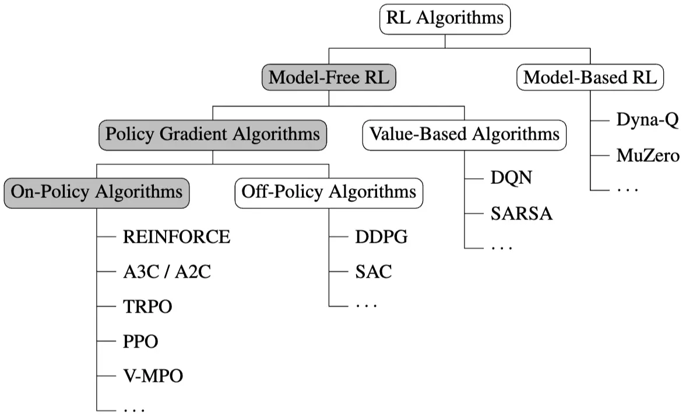
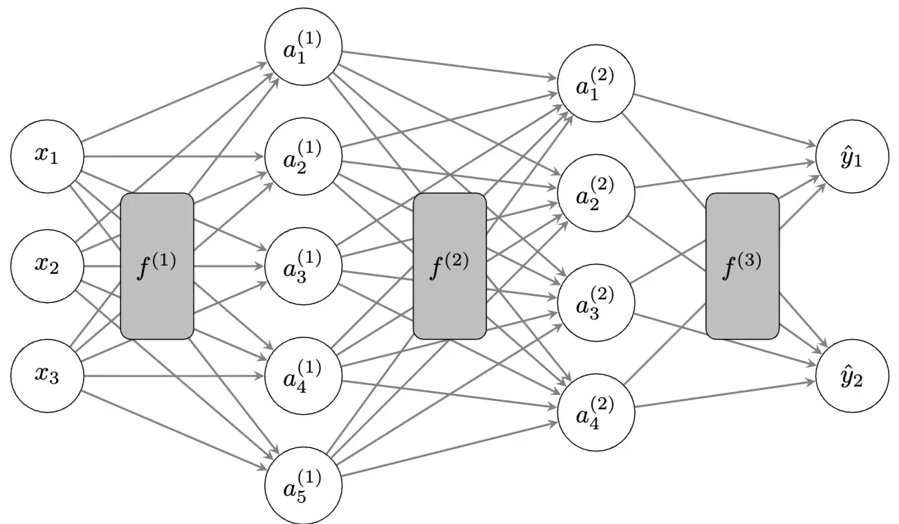
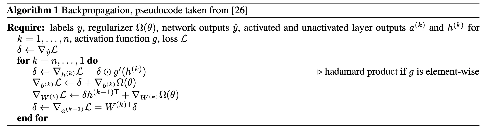
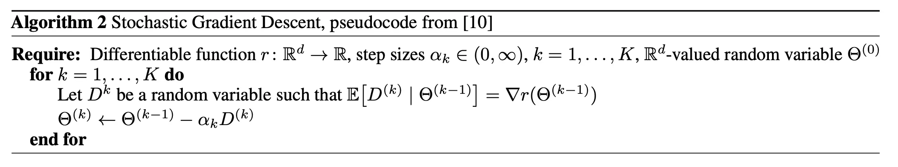
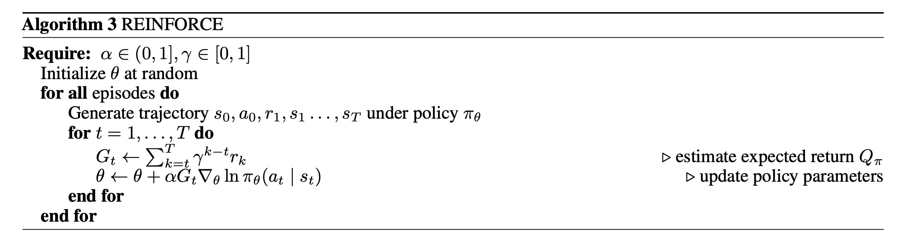
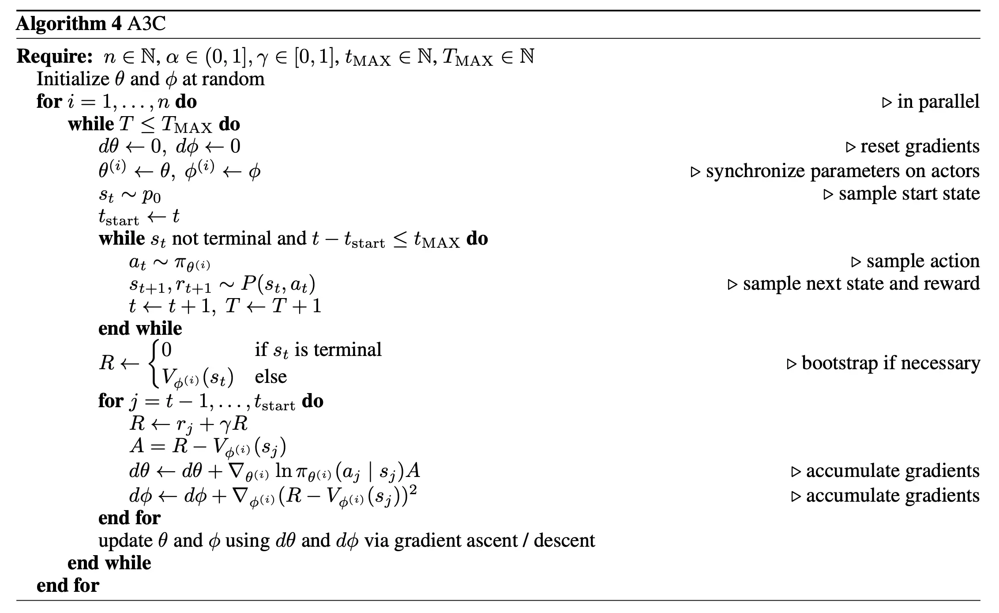
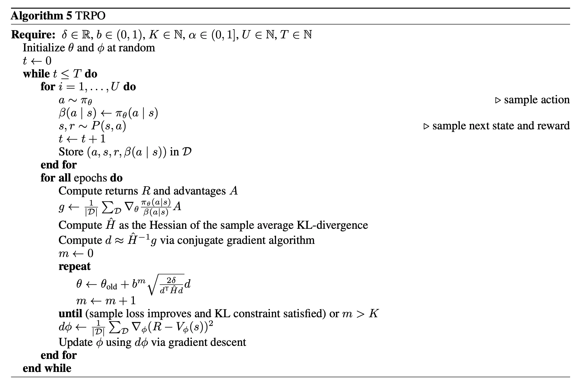

> [!abstract]
>
> 这篇综述的目标是全面概述 **On-Policy 的策略梯度算法**：
>
> - [第二节](#2-preliminaries) 概述了深度强化学习需要的 **符号表示**、**强化学习基础知识** 以及必要的 **深度学习基础知识**。虽然这部分内容基本上大多数人都熟悉了，但是我正好借着这篇综述总结一下。
> - [第三节](#3-theoretical-foundations-of-pg) 介绍了策略梯度算法的理论基础，包括 **Policy Gradient Theorem** 连续版本的详细证明、使用 Baseline 以及优势函数来降低方差的技术。
> - [第四节](#4-policy-gradient-algorithms) 介绍了当前最流行最重要的策略梯度算法，包括 REINFORCE、A2C、TRPO、PPO 以及 V-MPO，这些算法可以看作一步一步更新迭代得到的，使用不同的技术提升学习的稳定性和效率，这里面我们需要学到的技术包括构造可采样的替代目标、正则化策略更新以及具体优化的细节等等。

## 1. Introduction

强化学习通过与环境交互的试错来实现学习最优策略的任务。在早期的强化学习，最成功的应用大多使用基于价值的方法，这些方法估计预期的未来奖励，从而为智能体的决策提供信息。但是这些方法只是间接优化了我们的真正目标——学习最优策略，况且基于价值的方法在具有连续动作空间的环境中应用并非易事。

在这篇综述中，我们讨论的是 **策略梯度算法**。策略梯度算法旨在学习最优策略，与基于价值的方法相比，策略梯度算法本质上学习随机策略，进而可以产生更加平滑的搜索空间，也在一定程度上弥补了为了优化策略而必须获取环境知识的探索问题，并且策略梯度方法可以在学习过程中实现策略的更平滑变化，这可能会带来更好的收敛特性。

这篇综述的目标是全面概述 **On-Policy 的策略梯度算法**，虽然排除了一些流行的算法，包括 DDPG 和 SAC 等等，具体来讲，**这篇综述做了下面几件事**：

- 全面介绍了策略梯度算法的理论基础，包括 Policy Gradient Theorem 连续版本的详细证明；
- 推导并且比较了最突出的策略梯度算法；
- 「Optional」 提供了高质量的伪代码、发布了这些[算法的高质量实现](https://github.com/Matt00n/PolicyGradientsJax)，虽然使用的是 Jax。

## 2. Preliminaries

主要分三个部分，分别是符号表示、强化学习回顾以及深度学习基础。

符号表示没有什么多说的，我们这里使用的基本都是 Lebesgue 积分，将 $\mathcal{A}$ 上可测函数 $f$ 的积分写成 $\int_{a \in \mathcal{A}} f(a) \mathrm{d}a \coloneqq \int_{a \in \mathcal{A}} f(a) \mathrm{d}\lambda (a)$。另外，我们使用 $\mathbb{E}_{X \sim p}[X]$ 和 $\operatorname*{Var}_{X \sim p}[X]$ 表示 $X$ 服从分布 $p$ 的期望和方差。使用 $\Delta (\mathcal{A})$ 表示可测空间 $\mathcal{A}$ 的概率分布集。对于变量或者函数 $x$，使用 $\hat{x}$ 表示对其的近似。

### 2.1 RL Basics

强化学习中的每一个问题都包含一个 Agent 和一个环境，环境包括 Agent 外部的所有事物，Agent 通过与环境交互实现某一个特定目标。交互的过程可以被形式化为一个马尔可夫决策过程/Markov Decision Process，我们将其写成一个元组 $\mathcal{M} = (\mathcal{S}, \mathcal{A}, P, \gamma, p_0)$，其中 $P: \mathcal{S} \times \mathcal{A} \rightarrow \Delta (\mathcal{S} \times \mathbb{R})$ 是环境的转移函数，定义了在状态 $s$ 下采取动作 $a$ 后，转移到新的环境状态 $s'$ 并获得奖励 $r \in \mathbb{R}$ 的概率 $P (s', r \mid s, a)$，$\gamma \in [0, 1]$ 是折扣率，$p_0 \in \Delta (\mathcal{S})$ 是潜在起始状态上的概率分布。

我们将状态、动作和奖励的序列 $\left(s_t, a_t, r_{t+1}, s_{t+1}, \ldots, s_{t+k-1}, a_{t+k-1}, r_{t+k}, s_{t+k}\right)$ 称为一个轨迹/Trajectory，一个单步轨迹 $\left(s_t, a_t, r_{t+1}, s_{t+1}\right)$ 称为一个转移/Transition。

在接下来的设定中，我们假设奖励 $r$ 是有界的、状态和动作空间都是连续的，并且我们限制在 Episodic 设定下，这意味着 Agent 与环境交互的步数是有限的，在交互结束后，环境被重置为初始状态，这说明轨迹的长度至多为 $T$。

强化学习的主要目标是解决一个控制问题，学习到一个策略 $\pi: \mathcal{S} \rightarrow \Delta (\mathcal{A})$，以最大化期望回报。我们讲的折扣回报 $G_t := \sum_{k=0}^{T} \gamma^k r_{t+k+1}$ 是从时间步 $t$ 开始的折扣奖励之和，在 Episodic 设定以及有界奖励设定下，显然折扣奖励是有界的。

使用 $\pi(a \mid s)$ 表示在策略 $\pi$ 下，在状态 $s$ 下采取动作 $a$ 的概率。对于一个策略 $\pi$，其平稳状态分布 $d^\pi$ 决定了在遵循 $\pi$ 时，在任何时间点处于特定状态 $s \in \mathcal{S}$ 的概率。

令 $\Pi$ 是所有可能策略的集合。用于控制问题的强化学习算法 $\mathfrak{A}: \Pi \rightarrow \Pi$ 通过不断与环境交互来采样转移，进而更新策略，之后我们将关注如何更新策略。强化学习的一个重要特征是，在学习中需要权衡探索和利用/Exploration-Exploitation Trade-off。Agent 对环境没有先验知识，因此需要探索不同的转移，以便了解哪些状态和动作是可取的。然而，由于状态空间和动作空间通常很大，因此利用已经获得的关于环境的知识对于引导搜索过程，找到最有希望的子空间中的最优策略也至关重要。解决这个探索问题的一个常见方法是向策略添加噪声。

接下来可以回顾价值函数、动作价值函数、Bellman 方程和价值迭代的概念：

- 价值函数 $V_\pi(s) := \mathbb{E}_\pi[G_t \mid S_t = s]$ 给出了从状态 $s$ 开始，在遵循策略 $\pi$ 时，选择所有后续动作的期望回报。
- 动作价值函数 $Q_\pi(s, a) := \mathbb{E}_\pi[G_t \mid S_t = s, A_t = a]$ 给出了从状态 $s$ 开始，先采取动作 $a$，之后在遵循策略 $\pi$ 时，选择所有后续动作的期望回报。
- 优势函数 $A^\pi(s, a) := Q_\pi(s, a) - V_\pi(s)$ 给出了动作 $a$ 在状态 $s$ 中相对于其他可能动作的好坏程度。

价值函数和动作价值函数之间有一个显然的关系

$$
V_\pi(s) = \int_{a \in \mathcal{A}} \pi(a \mid s) Q_\pi(s, a) \mathrm{d}a
$$

还可以推导出贝尔曼方程：

$$
\begin{aligned}
V_\pi(s) &= \mathbb{E}_\pi[G_t \mid S_t = s] = \mathbb{E}_\pi[R_{t+1} + \gamma G_{t+1} \mid S_t = s] \\
&= \mathbb{E}_\pi[R_{t+1} + \gamma V_\pi(S_{t+1}) \mid S_t = s] \\
&= \int_{a \in \mathcal{A}} \pi(a \mid s) \left( \int_{s' \in \mathcal{S}}\int_{r \in \mathbb{R}} P (s', r \mid s, a) \left( r + \gamma \mathbb{E}_\pi[G_{t+1} \mid S_{t+1} = s'] \right) \mathrm{d}s' \mathrm{d}r \right) \mathrm{d}a \\
&= \int_{a \in \mathcal{A}} \pi(a \mid s) \left( \int_{s' \in \mathcal{S}}\int_{r \in \mathbb{R}} P (s', r \mid s, a) \left( r + \gamma V_\pi(s') \right) \mathrm{d}s' \mathrm{d}r \right) \mathrm{d}a \\
\end{aligned}
$$

简单来讲，贝尔曼方程就是下面两个使用期望形式表示的等式：

$$
\begin{aligned}
V_\pi(s) &= \mathbb{E}_\pi[R_{t+1} + \gamma V_\pi(S_{t+1}) \mid S_t = s] \\
Q_\pi(s, a) &= \mathbb{E}_\pi[R_{t+1} + \gamma Q_\pi(S_{t+1}, A_{t+1}) \mid S_t = s, A_t = a]
\end{aligned}
$$

我们知道，强化学习的目标是得到最大化期望回报，这对应着一个最优的策略，这里的最优按照下面定义：如果一个策略 $\pi^*$ 满足对于所有状态 $s \in \mathcal{S}$，有 $V_{\pi^*}(s) \geq V_\pi(s)$，则称 $\pi^*$ 是最优策略。使用一些机器学习理论的知识：**对每一个有限 MDP 中，都存在一个确定性的最优策略**。所有最优策略共享相同的最优价值函数 $V^*(s) := \max_{\pi \in \Pi} V_\pi(s)$ 和最优动作价值函数 $Q^*(s, a) := \max_{\pi \in \Pi} Q_\pi(s, a)$。这意味着我们也有对应的 Bellman 方程

$$
Q^*(s, a) = \mathbb{E}[R_{t+1} + \gamma Q^*(S_{t+1}, A_{t+1}) \mid S_t = s, A_t = a]
$$

利用最优性，我们也有下面的 **广义策略迭代/Generalized Policy Iteration** 算法：

> [!info] Generalized Policy Iteration
>
> 令 $\pi_{\text{old}}$ 为当前策略。那么，广义策略迭代通过以下方式更新其策略：
>
> $$
> \pi_{\text{new}} \in \arg \max_{\pi \in \Pi} \mathbb{E}_{A \sim \pi_{\text{old}}}[Q_{\pi_{\text{old}}}(s, A)]
> $$
>
> 对于所有 $s \in \mathcal{S}$。令 $\pi_n$ 通过广义策略迭代获得的一系列策略。那么，这个序列收敛到一个最优策略，即
>
> $$
> \lim_{n \to \infty} \pi_n = \pi^*, \lim_{n \to \infty} Q_{\pi_n} = Q^*
> $$

### 2.2 On-Policy Policy Gradient

这部分分别介绍函数近似、策略梯度方法和 On-Policy 方法。

早期的强化学习方法本质上是表学习方法，通过维护查找表来学习价值函数、动作-价值函数以及策略的精确表示，虽然这些方法都有理论的收敛保证，但是并不能很好的推广到连续状态和动作空间，这主要是因为其很难将学习从一个已知的状态推广到其他状态。解决方法是使用函数逼近，我们参数化要学习的函数，这些参数在学习中进行调整，并且选择对于输入连续的函数逼近，就可以进行很好的泛化。当然，现在的工作一般都使用神经网络来进行函数逼近，这些领域被称为深度强化学习。

基于价值的方法目标在学习一系列收敛到最优价值函数的价值函数，然后就可以推断出最优策略。与之对比的是基于策略的方法，主要思想是增加产生高回报动作的概率，直到收敛到（近似）最优策略。虽然显然有很多方法可以解决这个优化问题，但是基于梯度的方法是最常用的。

> [!info] Policy Gradient Algorithm
>
> 设 $\pi_\theta: \mathcal{S} \rightarrow \Delta (\mathcal{A})$ 是一个完全可微的函数，其可学习参数 $\theta \in \mathbb{R}^d$ 将状态映射到动作上的概率分布。设 $J : \mathbb{R}^d \rightarrow \mathbb{R}$ 是参数的某一种性能度量。如果任何学习算法通过在 $J$ 上进行梯度上升/下降来更新 $\theta$，从而学习其策略 $\pi_\theta$，即其更新具有以下一般形式，则我们称之为策略梯度算法：
>
> $$
> \theta_{\text{new}} \leftarrow \theta + \alpha \nabla_\theta J(\theta),
> $$
>
> 其中 $\alpha \in \mathbb{R}$ 是该算法的步长参数。

我们有两种方式可以使策略输出动作的概率分布，进而从中采样动作。对于离散动作空间，我们使用 Softmax 进行归一化：

$$
\pi(a \mid s) = \frac{\exp(\pi_\theta (a \mid s))}{\sum_{a' \in \mathcal{A}} \exp(\pi_\theta (a' \mid s))}
$$

对于连续动作空间，我们令 $\pi_\theta$ 输出高斯分布的均值 $\mu_\theta$ 和标准差 $\sigma_\theta$，即 $\pi_\theta (s) = (\mu_\theta (s), \sigma_\theta (s))$，使得

$$
\pi(a \mid s) = \frac{1}{\sigma_\theta (s) \sqrt{2\pi}} \exp \left( -\frac{(a - \mu_\theta (s))^2}{2\sigma_\theta (s)^2} \right)
$$

这意味着我们为每一个状态都学习了一个动作的概率分布，根据概率分布采样动作。由于强化学习的动作空间一般是有界的，从这类高斯分布采样的动作一般通过裁剪或者挤压来进行转换，使得其落在动作空间之内。

最后，我们区分 On-Policy 和 Off-Policy 方法。在强化学习中，我们区分行为策略和目标策略。

- **行为策略**是一种生成数据的策略，数据的形式为我们希望学习的轨迹，这是我们在与环境交互时从中采样动作的策略。
- **目标策略**是我们想要了解的策略，我们评估这个策略在环境下的性能，然后加以改进。

比如 Q-Learning 和 DQN 都是 Off-Policy 方法。但是我们在这里只讨论 On-Policy 方法。

### 2.3 Deep Learning Basics

这一节就简单记一记了，我们主要是用前馈网络/Feedforward Neural Network/MLP，不会使用 Transformers。

深度学习相对于传统的机器学习技术，主要优势在于可以使用简单非线性函数的组合从原始数据中学习多个级别的表示来完成预测任务，后者往往需要手工设计的表示作为输入。

MLP 可以表示是一堆函数的组成

$$
f = f^{(n+1)} \circ \cdots \circ f^{(1)}
$$

我们将前 $n$ 层都称为隐藏层，最后一层 $f^{(n+1)}$ 称为输出层。$n$ 表示网络中隐藏层的数量，每一个隐藏层的特征在于其层宽度 $N_i$。设 $N_0$ 和 $N_{n+1}$ 分别为输入和输出向量的大小。那么，我们可以将每一层写成

$$
f^{(i)}(x) = g(W^{(i)}x + b^{(i)}),
$$

其中 $x$ 是前一层的输出，或者当 $i = 1$ 时是网络的输入，$W^{(i)} \in \mathbb{R}^{N_i \times N_{i-1}}$ 和 $b^{(i)} \in \mathbb{R}^{N_i}$ 分别是该层的权重矩阵和偏置向量，而 $g : \mathbb{R} \rightarrow \mathbb{R}$ 是引入非线性的可微激活函数，对每一个元素逐个应用。

显然可以发现，一个 MLP 可以通过其层大小、层深度以及激活函数类型来表征，也就是使用 $a = \left( (N_i)_{i=0}^{n+1}, g \right)$ 来表征。Universal Approximation Theorem 表明，一个 MLP 只需要有一个隐藏层，且激活函数满足一些弱条件，就可以在给定的任意精度下近似任何一个在给定紧集上的连续函数，在一些广义形式下，甚至可以近似任何可测函数。ReLU 是隐藏层的标准激活函数，对于回归任务，输出层通常不使用激活函数，而对于分类任务，通常使用 sigmoid 或 softmax 函数。每一个隐藏层的每一个元素都被称为一个神经元，任何层的输出 $a^{(i)}(x) = \left( f^{(i)} \circ \cdots \circ f^{(1)} \right)(x)$ 都是输入 $x$ 的学习表示。我们用 $\hat{y}$ 表示神经网络的输出 $f(x)$，即预测值。

对深度学习而言，假设集 $\mathcal{F}$ 的选择是通过选定架构 $a$ 隐式完成的，也就是说，对于具有架构 $a$ 的MLP，其假设集为所有具有该架构的 MLP，记作 $\mathcal{F}_a$，这里面的所有 MLP 只在权重和偏置上有所不同。我们将这些网络的可学习参数收集在扁平化的参数向量 $\theta \in \mathbb{R}^d$ 中，将具有参数 $\theta$ 的 MLP 记作 $f_\theta$。

给定一个假设集 $\mathcal{F}_a$，我们现在的目标是学习一个神经网络 $f_\theta \in \mathcal{F}_a$，即学习参数 $\theta$，从而减少预期风险

$$
\mathcal{R}(f) := \mathbb{E}_{Z \sim \mathbb{P}_Z} [\mathcal{L}(f, Z)] = \int_{z \in \mathcal{Z}} \mathcal{L}(f, z) \mathrm{d}\mathbb{P}_Z(z),
$$

其中 $\mathcal{L}: \mathcal{F} \times \mathcal{Z} \rightarrow \mathbb{R}$ 是损失函数。我们假设训练数据 $S = \{z^{(1)}, \ldots, z^{(m)}\}$ 和未见过的样本外数据 $z \in \mathcal{Z}$ 是独立同分布取样的。

常见损失函数包括多用于分类任务的二元交叉熵损失：

$$
\mathcal{L}(f, (x, y)) = - (y \cdot \ln(f(x)) + (1 - y) \cdot \ln(1 - f(x))),
$$

以及多用于回归任务的均方误差损失/MSE：

$$
\mathcal{L}(f, (x, y)) = (y - f(x))^2,
$$

有时候损失函数会通过正则化项 $\Omega(\theta)$ 进行增强，比如使用 L2 惩罚，对参数添加项 $\beta \cdot \lVert \theta \rVert_2^2$，其中 $\beta \in \mathbb{R}$ 是正则化系数。

一般来讲，背后数据分布 $\mathbb{P}_Z$ 是未知的，我们使用频率学派的方法，使用基于采样训练数据 $S$ 的经验分布来代替它，并使用经验风险最小化/ERM 作为学习算法来最小化它：

> [!info] Empirical Risk
>
> 给定训练数据 $S = \{z^{(1)}, \ldots, z^{(m)}\}$ 和函数 $f_\theta \in \mathcal{M}(\mathcal{X}, \mathcal{Y})$，经验风险定义为
>
> $$
> \hat{\mathcal{R}}_S(f_\theta) = \frac{1}{m} \sum_{i=1}^{m} \mathcal{L}(f_\theta, z^{(i)}),
> $$

> [!info] ERM Learning Algorithm
>
> 给定假设集 $\mathcal{F}_a$ 和训练数据 $S$，经验风险最小化算法 $\mathfrak{A}_{erm}$ 终止于找到一个（近似于）最小化经验风险的函数 $\hat{f}_S \in \mathcal{F}_a$：
>
> $$
> \mathfrak{A}_{erm}(S) = \hat{f}_S \in \operatorname*{\arg\min}_{f \in \mathcal{F}_a} \hat{\mathcal{R}}_S (f),
> $$

基于反向传播算法可以高效计算逐点导数，因此我们使用梯度优化算法来完成这个优化问题。反向传播实际上运用了链式法则，目标函数 $\mathcal{L}$ 相对于某一层的输入 $a^{(i-1)}$ 可以通过从相对于这一层的输出 $a^{(i)}$ 的梯度向后计算得到，即

$$
\nabla_{a^{(i-1)}} \mathcal{L} = \sum_{j} (\nabla_{a^{(i-1)}} a_j^{(i)}) \cdot \frac{\partial \mathcal{L}}{\partial a_j^{(i)}},
$$

将反向传播的过程形成算法如下：

一般情况下，对整个训练集上的数据计算经验风险的代价是昂贵的，更遑论计算梯度了，因此我们更偏向于使用训练集的一个子集来计算梯度与更新参数，这也会带来更快的收敛速度。在每次迭代中，从训练数据中随机抽取大小为 $m' \leq m$ 的一批数据 $S'$（通常 $m' \ll m$）来进行更新：

$$
\Theta^{(k)} := \Theta^{(k-1)} - \alpha_k \frac{1}{m'} \sum_{z \in S'} \nabla_\theta \mathcal{L}(f_{\Theta^{(k-1)}}, z),
$$

这里面 $\alpha_k$ 是第 $k$ 次迭代中的步长或学习率。学习率通常在训练过程中衰减以帮助收敛。这个操作其实就是小批量随机梯度下降/minibatch SGD，在算法上形式化如下：

随机梯度下降虽然简单，具有随机性，并且损失函数高度非凸，但是性质很好，比如可以引入随机波动，从而能够逃离鞍点，其收敛性也可以有一定的保障。现在我们更经常使用 Adam 等引入了动量方法以及自适应梯度缩放的算法。

参数 $\theta$ 的初始化对于收敛也十分重要，偏重一般初始化为 0，权重则使用很多策略，随机初始化为接近于 0 的值。

最后，无论损失函数的非凸性质如何，如果神经网络足够大，架构设置合理，局部最小值就不被认为是一个问题。从实践来讲，神经网络的训练是一个迭代过程，我们交替选择网络架构以及学习算法的超参数，近似最小化这组超参数的经验风险，从而找到合适的超参数集合，最大化泛化性能。

## 3. Theoretical Foundations of PG

### 3.1 Policy Gradient Theorem

给定一个 MDP $M = (\mathcal{S}, \mathcal{A}, P, \gamma, p_0)$，考虑一个参数化的、几乎处处可微的策略 $\pi_\theta$，以及以下目标函数 $J$，用于最大化预期的 episodic 回报：

$$
\begin{aligned}
J(\theta) &= \mathbb{E}_{S_0 \sim p_0, \pi_\theta}[G_0] \\
&= \mathbb{E}_{S_0 \sim p_0}\left[\mathbb{E}_{\pi_\theta}[G_t | S_t = S_0]\right] \\
&= \mathbb{E}_{S_0 \sim p_0}[V_{\pi_\theta}(S_0)],
\end{aligned}
$$

策略梯度算法的思想是通过对参数 $\theta$ 进行梯度上升来最大化目标函数 $J(\theta)$，因此我们需要求出梯度 $\nabla_\theta J(\theta)$。但是从先验上，右侧的期望 $\mathbb{E}_{S_0 \sim p_0, \pi_\theta}[G_0]$ 同时收到策略 $\pi_\theta$ 变化影响，这是因为状态分布 $d^\pi$ 自然会随着策略变化而变化。

策略梯度定理的意义就在于其解决了这个难题，给出了一个便于采样的梯度表达式，表达式的形式并不依赖于状态分布 $d^\pi$ 的导数。

> [!theorem] Policy Gradient Theorem
>
> 对于一个给定的 MDP，策略 $\pi_\theta$ 关于 $\theta$ 可微且 $\nabla_\theta \pi_\theta$ 有界，动作价值函数 $Q^{\pi_\theta}$ 关于 $\theta$ 也可微且对于所有 $s \in \mathcal{S}$ 和 $a \in \mathcal{A}$，$\nabla_\theta Q^{\pi_\theta}$ 有界。那么存在一个常数 $\eta$，使得
>
> $$
> \nabla_\theta J(\theta) = \eta \, \mathbb{E}_{S \sim d^{\pi_\theta}, A \sim \pi_\theta} [Q_{\pi_\theta}(S, A) \nabla_\theta \ln \pi_\theta(A \mid S)].
> $$

接下来部分是该定理的证明，我们遵循 [Sutton & Barto: Reinforcement Learning, 2nd Edition](http://incompleteideas.net/book/the-book-2nd.html) 的证明，并且将其扩展到了连续的状态与动作空间，在证明中，我们省略了所有的下标 $\theta$，但是需要知道的是，这里面的策略 $\pi$ 和所有的梯度 $\nabla$ 都依赖于参数 $\theta$。

首先处理目标函数：我们显示写出对于起始状态的期望，使用价值函数和动作价值函数的关系：

$$
\begin{aligned}
\nabla J(\theta) &= \nabla \mathbb{E}_{S \sim p_0}[V_\pi(S)] \\
&= \nabla \int_{s \in \mathcal{S}} p_0(s) V_\pi(s) \mathrm{d}s \\
&= \nabla \int_{s \in \mathcal{S}} p_0(s) \int_{a \in \mathcal{A}} \pi(a \mid s) Q_\pi(s, a) \mathrm{d}a \mathrm{d}s \\
&= \int_{s \in \mathcal{S}} p_0(s) \left[ \int_{a \in \mathcal{A}} (\nabla \pi(a \mid s)) Q_\pi(s, a) \mathrm{d}a + \int_{a \in \mathcal{A}} \pi(a \mid s) \nabla Q_\pi(s, a) \mathrm{d}a \right] \mathrm{d}s.
\end{aligned} \tag{1}
$$

这里使用了 Leibniz 积分法则，交换了积分和微分的顺序，然后再使用乘法法则。这里使用定理的条件成立，因为对于任何 $s \in \mathcal{S}$，$\pi(\cdot \mid s) Q_\pi(s, \cdot)$ 是可积的，并且对于所有 $s \in \mathcal{S}$ 和 $a \in \mathcal{A}$，其偏导数存在且有界，因为 $\pi$ 和 $Q_\pi$ 是有界的，且根据假设，$\nabla Q_\pi$ 和 $\nabla \pi$ 存在且有界。

下面处理动作价值函数的梯度，注意到一件本质的事情：**在给定某个动作 $a$ 后，实际的回报 $r$ 和环境的状态转移并不依赖于策略 $\pi$**，因此我们可以将其视为常数，因此就有：

$$
\begin{aligned}
\nabla Q_\pi(s, a) &= \nabla \int_{s' \in \mathcal{S}} \int_{r \in \mathbb{R}} P(s', r \mid s, a) \, (r + V_\pi(s')) \mathrm{d}r \, \mathrm{d}s' \\
&= \int_{s' \in \mathcal{S}} \int_{r \in \mathbb{R}} P(s', r \mid s, a) \, \nabla V_\pi(s') \mathrm{d}r \, \mathrm{d}s' \\
&= \int_{s' \in \mathcal{S}} \int_{r \in \mathbb{R}} P(s', r \mid s, a) \nabla V_\pi(s') \mathrm{d}r \, \mathrm{d}s' \\
&= \int_{s' \in \mathcal{S}} \left[ \int_{r \in \mathbb{R}} P(s', r \mid s, a) \mathrm{d}r \right] \nabla V_\pi(s') \mathrm{d}s' \\
&= \int_{s' \in \mathcal{S}} P(s' \mid s, a) \nabla V_\pi(s') \mathrm{d}s'
\end{aligned} \tag{2}
$$

然后处理价值函数的梯度，对所有的 $s \in \mathcal{S}$，有

$$
\begin{aligned}
\nabla V_\pi(s) &= \nabla \int_{a \in \mathcal{A}} \pi(a \mid s) Q_\pi(s, a) \mathrm{d}a \\
&= \int_{a \in \mathcal{A}} (\nabla \pi(a \mid s)) Q_\pi(s, a) \mathrm{d}a + \int_{a \in \mathcal{A}} \pi(a \mid s) \nabla Q_\pi(s, a) \mathrm{d}a \\
\end{aligned} \tag{3}
$$

这个式子和 (1) 的内层表达式是一致的，我们可以使用 (2) 和 (3) 来将 (1) 转换为递归形式，然后展开该递归，以得到一个显示形式。我们定义下符号：

$$
\phi(s) := \int_{a \in \mathcal{A}} (\nabla \pi(a \mid s)) Q_\pi(s, a) \mathrm{d}a \tag{4}
$$

对 (1) 使用 (3) 和 (2)，并重新排列积分，得到

$$
\begin{aligned}
\nabla J(\theta) &= \int_{s \in \mathcal{S}} p_0(s) \left[ \int_{a \in \mathcal{A}} (\nabla \pi(a \mid s)) Q_\pi(s, a) \mathrm{d}a + \int_{a \in \mathcal{A}} \pi(a \mid s) \nabla Q_\pi(s, a) \mathrm{d}a \right] \mathrm{d}s \\
&= \int_{s \in \mathcal{S}} p_0(s) \left(\phi(s) + \int_{a \in \mathcal{A}} \pi(a \mid s) \nabla Q_\pi(s, a) \mathrm{d}a \right) \mathrm{d}s \\
&= \int_{s \in \mathcal{S}} p_0(s) \left(\phi(s) + \int_{a \in \mathcal{A}} \pi(a \mid s) \int_{s' \in \mathcal{S}} P(s' \mid s, a) \nabla V_\pi(s') \mathrm{d}s' \mathrm{d}a \right) \mathrm{d}s \\
&= \int_{s \in \mathcal{S}} p_0(s) \left(\phi(s) + \int_{s' \in \mathcal{S}} \int_{a \in \mathcal{A}} \pi(a \mid s) P(s' \mid s, a) \mathrm{d}a \, \nabla V_\pi(s') \mathrm{d}s' \right) \mathrm{d}s \\
\end{aligned} \tag{5}
$$

这里最后一步使用了 Fubini 定理交换了积分顺序。这是因为 $\nabla V_\pi$ 有界，且 $\pi(\cdot \mid s) P(\cdot \mid s, \cdot)$ 是 $\mathcal{S} \times \mathcal{A}$ 上的概率测度，因此 $|\pi(\cdot \mid s) P(\cdot \mid s, \cdot) \nabla V_\pi|$ 在乘积空间 $\mathcal{S} \times \mathcal{A}$ 上是可积的。

为了在时间上展开公式 (5)，我们引入多步转移概率的符号。设 $\rho_\pi(s \rightarrow s', k)$ 为在策略 $\pi$ 下经过 $k$ 步后从状态 $s$ 转移到 $s'$ 的概率。我们显然有

$$
\begin{aligned}
\rho_\pi(s \rightarrow s', 0) &:= \begin{cases} 1 & \text{if } s = s' \\ 0 & \text{else} \end{cases} \\
\rho_\pi(s \rightarrow s', 1) &:= \int_{a \in \mathcal{A}} \pi(a|s) P(s'|s, a) \mathrm{d}a \\
\rho_\pi(s \rightarrow s', k + 1) &:= \int_{s' \in S} \rho_\pi(s \rightarrow s', k) \rho_\pi(s' \rightarrow s'', 1) \mathrm{d}s'
\end{aligned}
$$

迭代地代入 (5)，不断使用 Fubini 定理：

$$
\begin{aligned}
\nabla J(\theta) &= \int_{s \in \mathcal{S}} p_0(s) \left(\phi(s) + \int_{s' \in \mathcal{S}} \int_{a \in \mathcal{A}} \pi(a \mid s) P(s' \mid s, a) \mathrm{d}a \, \nabla V_\pi(s') \mathrm{d}s' \right) \mathrm{d}s \\
&= \int_{s \in \mathcal{S}} p_0(s) \left(\phi(s) + \int_{s' \in \mathcal{S}} \rho_\pi(s \rightarrow s', 1) \nabla V_\pi(s') \mathrm{d}s' \right) \mathrm{d}s \\
&= \int_{s \in \mathcal{S}} p_0(s) \left\{ \phi(s) + \int_{s' \in \mathcal{S}} \rho_\pi(s \rightarrow s', 1) \left[ \phi(s') + \int_{a \in \mathcal{A}} \pi(a \mid s') \nabla Q_\pi(s', a) \mathrm{d}a \right] \mathrm{d}s' \right\} \mathrm{d}s \\
&= \int_{s \in \mathcal{S}} p_0(s) \left\{ \phi(s) + \int_{s' \in \mathcal{S}} \rho_\pi(s \rightarrow s', 1) \left[ \phi(s') + \int_{s'' \in \mathcal{S}} \rho_\pi(s' \rightarrow s'', 1) \nabla V_\pi(s'') \mathrm{d}s'' \right] \mathrm{d}s' \right\} \mathrm{d}s \\
&= \int_{s \in \mathcal{S}} p_0(s) \left\{ \phi(s) + \int_{s' \in \mathcal{S}} \rho_\pi(s \rightarrow s', 1) \phi(s') \mathrm{d}s' + \int_{s'' \in \mathcal{S}} \left(\int_{s' \in \mathcal{S}} \rho_\pi(s \rightarrow s', 1) \rho_\pi(s' \rightarrow s'', 1) \mathrm{d}s'\right) \nabla V_\pi(s'') \mathrm{d}s''  \right\} \mathrm{d}s \\
&= \int_{s \in \mathcal{S}} p_0(s) \left\{ \phi(s) + \int_{s' \in \mathcal{S}} \rho_\pi(s \rightarrow s', 1) \phi(s') \mathrm{d}s' + \int_{s'' \in \mathcal{S}} \rho_\pi(s \rightarrow s'', 2) \nabla V_\pi(s'') \mathrm{d}s''  \right\} \mathrm{d}s \\
&= \int_{s \in \mathcal{S}} p_0(s) \left\{ \sum_{k=0}^{t-1} \int_{s' \in \mathcal{S}} \rho_\pi(s \rightarrow s', k) \phi(s') \mathrm{d}s' + \int_{s' \in \mathcal{S}} \rho_\pi(s \rightarrow s', t) \nabla V_\pi(s') \mathrm{d}s'  \right\} \mathrm{d}s \\
&= \int_{s \in \mathcal{S}} p_0(s) \int_{s' \in \mathcal{S}} \sum_{t=0}^{T} \rho_\pi(s \rightarrow s', t) \phi(s') \mathrm{d}s' \mathrm{d}s
\end{aligned}
$$

令 $\eta_s(s') := \sum_{t=0}^{T} \rho^\pi(s \rightarrow s', t)$，考虑 $\eta_s(s')$ 的含义，其代表了在策略 $\pi$ 下，从状态 $s$ 出发，经过任意步后到达状态 $s'$ 的概率总和。对起始状态分布求积分，并且进行归一化（这是因为很有可能这不是一个概率分布），可以注意到

$$
d^\pi(s') = \int_{s \in \mathcal{S}} p_0(s) \eta_s(s') \mathrm{d}s / \int_{s'' \in \mathcal{S}}\int_{s \in \mathcal{S}} p_0(s) \eta_s(s'') \mathrm{d}s \mathrm{d}s''
$$

重新排列积分顺序可以得到：

$$
\begin{aligned}
\nabla_\theta J(\theta) &= \int_{s \in \mathcal{S}} p_0(s) \int_{s' \in \mathcal{S}} \sum_{t=0}^{T} \rho_\pi(s \rightarrow s', t) \phi(s') \mathrm{d}s' \mathrm{d}s \\
&= \int_{s' \in \mathcal{S}} \int_{s \in \mathcal{S}} p_0(s) \eta_s(s') \phi(s') \mathrm{d}s \mathrm{d}s' \\
&= \frac{\int_{s'' \in \mathcal{S}} \int_{s \in \mathcal{S}} p_0(s) \eta_s(s'') \mathrm{d}s \mathrm{d}s''}{\int_{s'' \in \mathcal{S}} \int_{s \in \mathcal{S}} p_0(s) \eta_s(s'') \mathrm{d}s \mathrm{d}s''} \int_{s' \in \mathcal{S}} \int_{s \in \mathcal{S}} p_0(s) \eta_s(s') \phi(s') \mathrm{d}s \mathrm{d}s' \\
&= \int_{s'' \in \mathcal{S}} \int_{s \in \mathcal{S}} p_0(s) \eta_s(s'') \mathrm{d}s \mathrm{d}s'' \cdot \int_{s' \in \mathcal{S}} \frac{\int_{s \in \mathcal{S}} p_0(s) \eta_s(s') \mathrm{d}s}{\int_{s'' \in \mathcal{S}} \int_{s \in \mathcal{S}} p_0(s) \eta_s(s'') \mathrm{d}s \mathrm{d}s''} \phi(s') \mathrm{d}s' \\
&= \int_{s \in \mathcal{S}} p_0(s) \int_{s'' \in \mathcal{S}} \eta_s(s'') \mathrm{d}s'' \mathrm{d}s \cdot \int_{s' \in \mathcal{S}} d^\pi(s') \phi(s') \mathrm{d}s'
\end{aligned}
$$

接下来就可以直接得出策略梯度定理的规范形式了：令常数 $\eta$ 定义如下：

$$
\eta := \int_{s \in \mathcal{S}} p_0(s) \int_{s'' \in \mathcal{S}} \eta_s(s'') \mathrm{d}s'' \mathrm{d}s
$$

因此

$$
\begin{aligned}
\nabla J(\theta) &= \int_{s \in \mathcal{S}} p_0(s) \int_{s'' \in \mathcal{S}} \eta_s(s'') \mathrm{d}s'' \mathrm{d}s \cdot \int_{s' \in \mathcal{S}} d^\pi(s') \phi(s') \mathrm{d}s' \\
&= \eta \int_{s' \in \mathcal{S}} d^\pi(s') \int_{a \in \mathcal{A}} (\nabla \pi(a \mid s')) Q_\pi(s', a) \mathrm{d}a \mathrm{d}s' \\
&= \eta \int_{s' \in \mathcal{S}} d^\pi(s') \int_{a \in \mathcal{A}} \pi(a \mid s') \frac{\nabla \pi(a \mid s')}{\pi(a \mid s')} Q_\pi(s', a) \mathrm{d}a \mathrm{d}s' \\
&= \eta \int_{s' \in \mathcal{S}} d^\pi(s') \int_{a \in \mathcal{A}} \pi(a \mid s') (\nabla \ln \pi(a \mid s')) Q_\pi(s', a) \mathrm{d}a \mathrm{d}s' \\
&= \eta \, \mathbb{E}_{S \sim d^\pi} \left[ \mathbb{E}_{A \sim \pi} \left[ Q_\pi(S, A) \nabla \ln \pi(A \mid S) \right] \right].
\end{aligned}
$$

这就完成了证明。

策略梯度定理给出了策略梯度的显式形式，我们可以从中对梯度进行采样。这就使得我们可以使用基于梯度的优化方法来直接优化策略，也构成了之后的策略梯度算法的基础。

最后我们给出对策略梯度公式的进一步说明，首先是参数 $\eta$ 的含义，简而言之，它是策略 $\pi$ 下的平均 episode 长度。

$$
\begin{aligned}
\eta &= \int_{s \in \mathcal{S}} p_0(s) \int_{s' \in \mathcal{S}} \eta_s(s') \mathrm{d}s' \mathrm{d}s = \int_{s \in \mathcal{S}} p_0(s) \int_{s' \in \mathcal{S}} \sum_{t=0}^{T} \rho_\pi(s \rightarrow s', t) \mathrm{d}s' \mathrm{d}s \\
&= \mathbb{E}_{S \sim p_0} \left[ \sum_{t=0}^{T} \int_{s' \in \mathcal{S}} \rho_\pi(S \rightarrow s', t) \mathrm{d}s' \right],
\end{aligned}
$$

其次，这个参数 $\eta$ 在优化算法的梯度更新中并不那么重要，由于我们使用基于梯度的方法，只要采样得到的梯度与真实梯度成比例即可（这是因为比例常数可以被学习率吸收），因此常数 $\eta$ 通常被省略，我们也通常将其写成

$$
\nabla_\theta J(\theta) \propto \mathbb{E}_{S \sim d^{\pi_\theta}, A \sim \pi_\theta} \left[ Q_{\pi_\theta} (S, A) \nabla_\theta \ln \pi_\theta (A | S) \right]. \tag{6}
$$

右侧所有项都是已知的或者可以通过采样来估计，这就允许我们设计多样的策略梯度算法。

### 3.2 Value Function Estimation

在实践中，当直接对公式 (6) 进行采样时，策略梯度的估计可能会引入非常多的噪声，因此，策略梯度算法的一个主要实际挑战是引入措施来降低梯度的方差。一种技术就是在对动作价值函数 $Q_\pi$ 进行采样估计的时候使用基线/Baseline，我们这里将证明，使用适当选择的基线不会使估计产生偏差，但可以大大降低采样梯度的方差。

令 $\hat{Q}(s, a)$ 为 $Q_\pi(s, a)$ 的采样估计，假设 $\mathbb{E}[\hat{Q}(s, a)] = Q_\pi(s, a)$。我们可以通过减掉一个基线 $b: \mathcal{S} \rightarrow \mathbb{R}$ 来构建一个新的估计 $\hat{Q}_b(s, a) = \hat{Q}(s, a) - b(s)$。这里对 $b$ 的唯一要求就是它不依赖于动作 $a$，除此之外其可以依赖于状态 $s$，甚至可以是一个随机变量。

我们采样估计的梯度 $\nabla_\theta J(\theta)$ 变为

$$
\hat{\nabla}_\theta J(\theta) = \nabla_\theta \ln \pi_\theta (a \mid s) [\hat{Q}(s, a) - b(s)].
$$

对于策略 $\pi$ 求期望，得到

$$
\begin{aligned}
\mathbb{E}_\pi[\hat{\nabla}_\theta J(\theta)] &= \mathbb{E}_\pi[\nabla_\theta \ln \pi_\theta (A \mid S) \, (\hat{Q}(S, A) - b(S))] \\
&= \mathbb{E}_\pi[\nabla_\theta \ln \pi_\theta (A \mid S) \, \hat{Q}(S, A)] - \mathbb{E}_\pi[\nabla_\theta \ln \pi_\theta (A \mid S) \, b(S)]
\end{aligned}
$$

下面我们证明第二部分其实就是 0，使用 Leibniz 积分法则，我们有

$$
\begin{aligned}
\mathbb{E}_{S \sim d^\pi, A \sim \pi}[\nabla_\theta \ln \pi_\theta (A \mid S) \, b(S)] &= \int_{s \in \mathcal{S}} d^\pi(s) \int_{a \in \mathcal{A}} \pi_\theta(a \mid s) \nabla_\theta \ln \pi_\theta (a \mid s) b(s) \mathrm{d}a \mathrm{d}s \\
&= \int_{s \in \mathcal{S}} d^\pi(s) b(s) \int_{a \in \mathcal{A}} \pi_\theta(a \mid s) \nabla_\theta \ln \pi_\theta (a \mid s) \mathrm{d}a \mathrm{d}s \\
&= \int_{s \in \mathcal{S}} d^\pi(s) b(s) \int_{a \in \mathcal{A}} \pi_\theta(a \mid s) \frac{\nabla_\theta \pi_\theta(a \mid s)}{\pi_\theta(a \mid s)} \mathrm{d}a \mathrm{d}s \\
&= \int_{s \in \mathcal{S}} d^\pi(s) b(s) \nabla_\theta \int_{a \in \mathcal{A}} \pi_\theta(a \mid s) \mathrm{d}a \mathrm{d}s \\
&= \int_{s \in \mathcal{S}} d^\pi(s) b(s) \nabla_\theta 1 \mathrm{d}s \\
&= 0
\end{aligned}
$$

因此，在对 $Q_\pi$ 的估计上减掉一个和动作无关的 Baseline $b$ 并不会给梯度估计造成任何的偏差，[High-Dimensional Continuous Control Using Generalized Advantage Estimation](https://arxiv.org/abs/1506.02438) 这篇文章将上述结果进行了推广，表明了即使基线依赖于当前和所有后续状态，这个结果依然成立。

下面我们简单分析减去基线 $b$ 可以降低采样梯度的方差。使用公式 $\operatorname*{Var}[X] = \mathbb{E}[X^2] - \mathbb{E}[X]^2$，由于上面已经证明了 $\mathbb{E}[X]^2$ 和基线 $b$ 无关，因此我们只需要分析 $\mathbb{E}[X^2]$ 的变化。我们有

$$
\begin{aligned}
\operatorname*{\arg\min}_b \operatorname{Var}_\pi[\nabla_\theta \ln \pi_\theta (A | S) [\hat{Q}(S, A) - b(S)]] &= \operatorname*{\arg\min}_b \mathbb{E}_\pi[(\nabla_\theta \ln \pi_\theta (A | S) [\hat{Q}(S, A) - b(S)])^2] \\
&\approx \operatorname*{\arg\min}_b \left[ \mathbb{E}_\pi[\nabla_\theta \ln \pi_\theta (A | S)^2] \cdot \mathbb{E}_\pi[\hat{Q}(S, A) - b(S)^2] \right],
\end{aligned}
$$

上面的近似基于这两个项的独立性的假设。在这个近似下，我们可以通过最小化 $\mathbb{E}_\pi[\hat{Q}(S, A) - b(S)]^2$ 来最小化采样梯度的方差。这是一个常见的最小二乘问题，只需要选择 $b(s) = \mathbb{E}_\pi [ \hat{Q}(s, A)]$ 即可。这表明选择一个恰当的 Baseline 可以显著降低梯度的方差。使用这个 Baseline，我们可以按照如下方式计算采样状态和动作的梯度

$$
\begin{aligned}
\nabla_\theta \ln \pi_\theta (a | s) [Q_\pi (s, a) - \mathbb{E}_{A \sim \pi_\theta} [Q_\pi (s, A)]] &= \nabla_\theta \ln \pi_\theta (a | s) [Q_\pi (s, a) - V_\pi (s)] \\
&= \nabla_\theta \ln \pi_\theta (a | s) A_\pi (s, a).
\end{aligned}
$$

这种选择的 Baseline 产生了梯度的最低可能方差。在实践中，优势函数必须也被估计，学习这种估计通常会引入偏差 :-) 这就涉及到了 Bias-Variance 权衡的问题。

### 3.3 Importace Sampling

Importance Sampling 是一种基于从一个分布中采样来估计另一个分布下的期望的技术。在 Off-Policy 强化学习中非常重要。在某些 On-Policy 的强化学习算法中，由于策略在处理完其采样的所有数据之前就更新了，因此这些数据就变得微微偏离 On-Policy 了，因此 Importance Sampling 也有了用武之地。我们简单介绍 Importance Sampling，可以参见我 [未完成的笔记](https://note.v1ceversaa.cc/RL/Sutton/Chapter%205.html#55-off-policy-prediction-via-importance-sampling)。

给定一个行为策略 $\beta$，我们想要估计目标策略 $\pi$ 的价值函数 $V_\pi$。一般来讲都会有 $V_\beta(s) = \mathbb{E}_\beta[G_t \mid S_t = s] \neq V_\pi(s)$。为了使用行为策略估计目标策略的价值函数，我们需要计算在任何策略 $\pi$ 下的轨迹 $(a_t, s_{t+1}, a_{t+1}, \ldots, a_{T-1}, s_T)$ 的出现概率：

$$
\prod_{k=t}^{T-1} \pi(a_k \mid s_k) P(s_{k+1} \mid s_k, a_k).
$$

这就可以定义 Importance Sampling Ratio：

> [!info] Importance Sampling Ratio
>
> 给定目标策略 $\pi$，行为策略 $\beta$ 和由 $\beta$ 生成的轨迹 $\tau = (a_t, s_{t+1}, a_{t+1}, \ldots, s_T)$，Importance Sampling Ratio 定义为
>
> $$
> \rho_{t:T-1} := \frac{\prod_{k=t}^{T-1} \pi(a_k \mid s_k) P(s_{k+1} \mid s_k, a_k)}{\prod_{k=t}^{T-1} \beta(a_k \mid s_k) P(s_{k+1} \mid s_k, a_k)} = \frac{\prod_{k=t}^{T-1} \pi(a_k \mid s_k)}{\prod_{k=t}^{T-1} \beta(a_k \mid s_k)}.
> $$

设 $\mathcal{T}$ 为可能轨迹的集合，我们通过将由行为策略 $\beta$ 生成的轨迹 $\tau \in \mathcal{T}$ 的回报与 Importance Sampling Ratio $\rho$ 相乘，我们得到

$$
\begin{aligned}
\mathbb{E}_\beta[\rho_{t:T-1} G_t \mid S_t = s] &= \mathbb{E}_\beta[\rho_{t:T-1} G(\tau) \mid S_t = s] \\
&= \sum_{\tau \in \mathcal{T}} \rho_{t:T-1} G(\tau) \prod_{k=t}^{T-1} \beta(a_k \mid s_k) P(s_{k+1} \mid s_k, a_k) \\
&= \sum_{\tau \in \mathcal{T}} \frac{\prod_{k=t}^{T-1} \pi(a_k \mid s_k)}{\prod_{k=t}^{T-1} \beta(a_k \mid s_k)} G(\tau) \prod_{k=t}^{T-1} \beta(a_k \mid s_k) P(s_{k+1} \mid s_k, a_k) \\
&= \sum_{\tau \in \mathcal{T}} G(\tau) \prod_{k=t}^{T-1} \pi(a_k \mid s_k) P(s_{k+1} \mid s_k, a_k) \\
&= \mathbb{E}_\pi[G_t \mid S_t = s] = V_\pi(s).
\end{aligned}
$$

这就使用了重要度采样比进行了矫正。直觉比较简单，为了评估目标策略 $\pi$，我们希望更多地权衡在 $\pi$ 更容易发生的回报，更少地权衡在 $\beta$ 更容易发生的回报。作为上述推导的扩展，我们还得到了逐决策重要度采样比率 $\rho := \frac{\pi(a \mid s)}{\beta(a \mid s)}$。

使用 Importance Sampling，我们可以推导出带有行为策略 $\beta$ 的 Off-Policy 设置中，目标策略 $\pi_\theta$ 的以下近似策略梯度：

$$
\nabla_\theta J(\theta) \approx \eta \, \mathbb{E}_{S \sim d^\beta, A \sim \beta} \left[ \frac{\pi_\theta (A \mid S)}{\beta(A \mid S)} Q_{\pi_\theta} (S, A) \nabla_\theta \ln \pi_\theta (A \mid S) \right].
$$

## 4. Policy Gradient Algorithms

基于策略梯度定理，已经提出了很多策略梯度算法，其计算基于样本的梯度估计 $\hat{\nabla}_\theta J(\theta)$。这些算法通过构造不同的替代目标 $J_*$ 来实现的，这些替代目标均满足 $\nabla_\theta J_*(\theta) = \hat{\nabla}_\theta J(\theta)$。除此之外，很多算法还关注对策略进行正则化，以及降低梯度估计 $\hat{\nabla}_\theta J(\theta)$ 的方差来稳定学习，这一节，我们将推导最重要的几种策略梯度算法，并且在章节的最后对这些算法的设计选择进行比较。

### 4.1 REINFORCE

[REINFORCE](https://link.springer.com/article/10.1007/BF00992696) 算法是最早的策略梯度算法，其名字来自于 REward Increment = Non-negative Factor × Offset Reinforcement × Characteristic Eligibility 的缩写。虽然该算法早于策略梯度定理的提出，但是可以看作是策略梯度定理的直接应用，其方法是使用 Monte Carlo 方法来估计公式 (6)，采样整个 episode 来计算样本回报 $G_t = \sum_{k=0}^{T} \gamma^k r_{t+k+1}$，REINFORCE 采样策略梯度

$$
\hat{\nabla}_\theta J(\theta) = G_t \nabla_\theta \ln \pi_\theta (a_t \mid s_t).
$$

然后使用一般的策略梯度更新来进行梯度上升：

$$
\theta_{\text{new}} = \theta + \alpha G_t \nabla_\theta \ln \pi_\theta (a_t \mid s_t)
$$

这里面 $\alpha \in (0, 1]$ 是学习率，决定了梯度步长的大小，并被设置为一个超参数。有时，REINFORCE 会通过从 $G_t$ 中减去一个 Baseline 来降低方差。

### 4.2 A3C

REINFORCE 算法仍然还是早期的深度强化学习算法，直接使用采样数据估计 $Q_\pi$，我们可以选择通过函数逼近来学习这样的估计。我们将动作价值函数 $\hat{Q}_\phi$ 或者价值函数 $\hat{V}_\phi$ 的参数化估计称为 Critic，而将参数化策略 $\pi_\theta$ 称为 Actor，使用这种方法来学习 Actor 和 Critic 的算法被称为 Actor-Critic 算法。这里面 Actor 和 Critic 可以共享参数。

Actor-Critic 算法里面最典型的代表是 [**Asynchronous Advantage Actor-Critic/A3C**](https://arxiv.org/abs/1602.01783) 算法。算法的名称表明了该算法的两个主要特点，首先，A3C 使用优势函数 $\hat{A}_\phi$ 的估计来替代 $Q_\pi$ 的估计来计算策略梯度，其次，A3C 使用多个并行的 Actor 来与环境交互以稳定训练。我们将在下面详细讨论这两个想法。

具体而言，A3C 算法采样策略梯度

$$
\hat{\nabla}_\theta J(\theta) = \frac{1}{\lvert \mathcal{D}\rvert} \sum_{s, a \in \mathcal{D}} \hat{A}_\phi(s, a) \nabla_\theta \ln \pi_\theta (a \mid s)
$$

这里面 $\mathcal{D}$ 是由多个 Actor 收集的一批转移。伪代码如下，我们会具体讨论这个算法。

在最初的工作中，优势函数 $\hat{A}_\phi$ 通过以下方式估计：

$$
\hat{A}_\phi(s_t, a_t) = \left( \sum_{i=0}^{k-1} \gamma^i r_{t+i} + \gamma^k \hat{V}_\phi(s_{t+k}) \right) - \hat{V}_\phi(s_t).
$$

这个估计其实也是使用了频率学派思想的一个例子，使用 $n$ 步时序差分来估计动作价值函数 $Q_\pi$：

$$
\begin{aligned}
A_\pi (s_t, a_t) &= Q_\pi (s_t, a_t) - V_\pi (s_t) \\
&= \mathbb{E}_\pi[R_{t+1} + \gamma V_\pi (S_{t+1}) | S_t = s_t, A_t = a_t] - V_\pi (s_t) \\
&= \mathbb{E}_\pi[R_{t+1} + \gamma R_{t+2} + \gamma^2 V_\pi (S_{t+2}) | S_t = s_t, A_t = a_t] - V_\pi (s_t) \\
&\quad \vdots \\
&= \mathbb{E}_\pi\left[\sum_{i=0}^{k-1}\gamma^i R_{t+i} + \gamma^k V_\pi (S_{t+k}) | S_t = s_t, A_t = a_t\right] - V_\pi (s_t),
\end{aligned}
$$

使用估计的 $\hat{V}_\phi$ 替代 $V_\pi$，并对上面的表达式进行采样，我们对优势函数的估计。在更新 Actor $\pi_\theta$ 的同时，我们通过最小化均方误差损失来学习 $\hat{V}_\phi$，更新 $\phi$ 的过程可以使用随机梯度下降：

$$
\frac{1}{\lvert \mathcal{D}\rvert} \sum_{\mathcal{D}} \left( \left(\sum_{i=0}^{k-1} \gamma^i r_{t+i} + \gamma^k \hat{V}_\phi(s_{t+k})\right) - \hat{V}_\phi(s_t) \right)^2
$$

注意到这个表达式内部的元素正好和优势函数的估计相同，对于优势函数，我们计算的是状态 $s_t$ 下选择动作 $a_t$ 的估计回报与在策略 $\pi$ 下状态 $s_t$ 的估计回报之间的差异。然而，$a_t$ 是从 $\pi$ 中采样的，因此对于真实价值函数 $V_\pi$，期望上这个差异应该为 0。**所以**，我们就可以使用最小二乘法最小化这个平方差来优化 $\phi$，更进一步，我们使用 semi-gradient 方法来优化 $\phi$，将第一项 $\sum_{i=0}^{k-1} \gamma^i r_{t+i} + \gamma^k \hat{V}_\phi(s_{t+k})$ 视为与 $\phi$ 无关，这样的 semi-gradient 可以提升学习的稳定性。

至于为什么使用多个并行的 Actor 来与环境交互，我们有以下原因。深度强化学习以不稳定著称，为了解决学习的不稳定性，使用 Off-Policy 算法的一个解决方式是使用 **经验回放缓冲区/Replay Buffer** 来存储复用采样到的转移，这可以提升样本效率并且降低方差。对于 On-Policy 的方法，我们使用多个 Actor $(\pi_\theta^{(1)}, \ldots, \pi_\theta^{(k)})$ 来在多个轨迹上积累梯度来降低噪声，这些积累的梯度被应用到一个集中维护的参数拷贝 $\theta$ 上，对这个 $\theta$ 进行更新参数，然后再把更新后的参数分发回各个 Actor。以异步方式这么做时，每个 Actor 在任意时刻都可能与其他 Actor 拥有不同的一组参数，这会降低跨 Actor 采样轨迹之间的相关性，进一步稳定学习。

最后，A3C 的策略损失通常会加入一个熵奖励/熵正则，防止策略过早地收敛到次优策略

$$
\hat{\nabla}_\theta J(\theta) = \frac{1}{\lvert \mathcal{D}\rvert} \sum_{\mathcal{D}} \left( \left(\sum_{i=0}^{k-1} \gamma^i r_{t+i} + \gamma^k \hat{V}_\phi(s_{t+k}) - \hat{V}_\phi(s_t)\right) \nabla_\theta \ln \pi_\theta (a_t \mid s_t) + \beta \nabla_\theta H(\pi_\theta(\cdot \mid s_t)) \right),
$$

这里的 $\beta$ 是一个超参数。通过奖励更高的熵，策略会在各个动作上更均匀地分配概率质量，从而改进探索。

### 4.3 TRPO

在强化学习算法的设计中，一个重要的考虑因素是策略更新的步长。过大的策略变化会引起训练的不稳定，即使是策略参数 $\theta$ 的小幅变化，也可能导致学习到的策略及其性能出现显著改变。因此，简单通过缩小梯度上升的步长并不能彻底解决该问题，且还会降低算法的样本效率。[**Trust Region Policy Optimization/TRPO**](https://arxiv.org/abs/1502.05477) 通过在相邻策略之间施加 KL 散度的信赖域约束来缓解这些问题，并且使用 Importance Sampling 处理优化与数据采集交替进行带来的轻微 Off-Policy 偏离。

具体而言，TRPO 采样的策略梯度为

$$
\hat{\nabla}_\theta J(\theta) = \frac{1}{\lvert \mathcal{D}\rvert} \sum_{s, a \in \mathcal{D}} \hat{A}_\phi(s, a) \nabla_\theta \frac{\pi_\theta(a \mid s)}{\pi_{\text{old}}(a \mid s)}.
$$

随后会按照如下方式解决这个近似信赖域优化问题：

$$
\begin{aligned}
\max_\theta & \quad \Big( J_{\text{TRPO}}(\theta) = \mathbb{E}_{S \sim d^{\pi_{\text{old}}}, A \sim \pi_{\text{old}}} \left[ \hat{A}_\phi(S, A) \frac{\pi_\theta(A \mid S)}{\pi_{\text{old}}(A \mid S)} \right] \Big) \\
\text{subject to} & \quad \mathbb{E}_{S \sim d^{\pi_{\text{old}}}} \left[ D_{KL}(\pi_{\text{old}}(\cdot \mid S) \| \pi_\theta(\cdot \mid S)) \right] \leq \delta.
\end{aligned}
$$

这里面 $\pi_{\text{old}} = \pi_{\theta_{\text{old}}}$ 表示上一个策略，$\theta_{\text{old}}$ 为其参数。这个优化问题是具有收敛性保证的，我们将一步一步分析。

我们首先考虑 TRPO 这篇文章的主要理论结果：令 $\eta(\tilde{\pi})$ 为在策略 $\tilde{\pi}$ 下的期望回报 $\mathbb{E}_{S_0 \sim p_0, \tilde{\pi}}[G_0]$，那么 $\eta(\tilde{\pi})$ 可以通过另一个策略 $\pi$ 和其优势函数来求解：

$$
\eta(\tilde{\pi}) = \eta(\pi) + \mathbb{E}_{\tau \sim \tilde{\pi}} \left[ \sum_{t=0}^{\infty} \gamma^t A_{\pi}(s_t, a_t) \right] = \eta(\pi) + \int_{s \in \mathcal{S}} d^{\tilde{\pi}}(s) \int_{a \in \mathcal{A}} \tilde{\pi}(a \mid s) A_{\pi}(s, a) \mathrm{d}a \mathrm{d}s.
$$

假设 $\tilde{\pi}$ 的状态访问密度和 $\pi$ 的状态访问密度相同，那么我们可以得到 $\eta(\tilde{\pi})$ 的局部一阶近似：

$$
\begin{aligned}
L_\pi(\tilde{\pi}) = \eta(\pi) &+ \int_{s \in \mathcal{S}} d^{\pi}(s) \int_{a \in \mathcal{A}} \tilde{\pi}(a \mid s) A_{\pi}(s, a) \mathrm{d}a \mathrm{d}s \\
L_{\pi_\theta}(\pi_\theta) &= \eta(\pi_\theta) \\
\left.\nabla_\theta L_{\pi_{\theta_0}}(\pi_\theta)\right|_{\theta = \theta_0} &= \left.\nabla_\theta \eta(\pi_\theta)\right|_{\theta = \theta_0}.
\end{aligned}
$$

定义 $D^{\max}_{TV}(\pi, \tilde{\pi}) = \max_{s \in \mathcal{S}} D_{TV}(\pi(\cdot \mid s) \| \tilde{\pi}(\cdot \mid s))$，则有

> [!theorem] Policy Optimization
>
> 令 $\alpha = D^{\max}_{TV}(\pi_{\text{old}}, \pi_{\text{new}})$，$\varepsilon = \max_{s \in \mathcal{S}, a \in \mathcal{A}} \lvert A_{\pi}(s, a) \rvert$，则
>
> $$
> \eta(\pi_{\text{new}}) \geq L_{\pi_{\text{old}}}(\pi_{\text{new}}) - \frac{4 \varepsilon \gamma}{(1 - \gamma)^2} \alpha^2.
> $$

利用全变分散度和 KL 散度的关系：$D_{TV}(\pi \|\tilde{\pi})^2 \le D_{KL}(\pi \|\tilde{\pi})$，令 $D^{\max}_{KL}(\pi, \tilde{\pi}) = \max_{s \in \mathcal{S}} D_{KL}(\pi(\cdot \mid s) \| \tilde{\pi}(\cdot \mid s))$，以及 $C = 4 \varepsilon \gamma / (1 - \gamma)^2$，我们可以将上述不等式使用 KL 散度来重写为：

$$
\eta(\pi_{\text{new}}) \geq L_{\pi_{\text{old}}}(\pi_{\text{new}}) - C D^{\max}_{KL}(\pi_{\text{old}}, \pi_{\text{new}}).
$$

这个不等式当且仅当 $\pi_{\text{new}} = \pi_{\text{old}}$ 时取等号。

这就出现了一件非常神奇的事情，迭代地优化不等式的右侧，我们可以得到一个策略序列 $\pi_i, \pi_{i+1}, \pi_{i+2}, \ldots$，并且这个序列的性能是单调改进的。具体而言，这是因为：

$$
\eta(\pi_{i+1}) - \eta(\pi_i) \geq \big( L_{\pi_i}(\pi_{i+1}) - C D^{\max}_{KL}(\pi_i, \pi_{i+1}) \big) - \big( L_{\pi_i}(\pi_i) - C D^{\max}_{KL}(\pi_i, \pi_i) \big).
$$

在对不等式右侧最大化的时候，这显然是对的。因此我们就可以构造一个 Minorization-Maximization 型算法，每次最大化不等式右侧的目标，并且由于这个目标是有界的，因此这个算法会收敛到一个局部最优。这个算法在理论上可行，但是并不实用，因为其需要对整个动作价值的乘积空间 $\mathcal{S} \times \mathcal{A}$ 上评估优势函数，并且需要对状态空间 $\mathcal{S}$ 上计算 KL 散度罚项。考虑 KL 散度罚项的含义，我们将其视为对策略更新的一个正则化项，防止策略更新过大，因此我们可以将其替换成一个信赖域约束：

$$
\begin{aligned}
\max_\theta & \quad L_{\pi_{\text{old}}}(\pi_\theta) \\
\text{subject to} & \quad D^{\max}_{KL}(\pi_{\text{old}}, \pi_\theta) \leq \delta.
\end{aligned}
$$

为了避免计算 $D^{\max}_{KL}$，TRPO 做了以下修改：可以将最大散度约束替换成期望散度约束作为我们可以采样的启发式约束：

$$
\bar{D}^{\pi_{\text{old}}}_{KL}(\pi \| \tilde{\pi}) := \mathbb{E}_{S \sim d_{\pi_{\text{old}}}} \left[ D_{KL}(\pi(\cdot \mid S) \| \tilde{\pi}(\cdot \mid S)) \right].
$$

进一步，我们可以使用重要性采样重写目标函数 $\max_\theta L_{\pi_{\text{old}}}(\pi_\theta)$：

$$
\begin{aligned}
\operatorname*{\arg\max}_\theta L_{\pi_{\text{old}}}(\pi_\theta) &= \operatorname*{\arg\max}_\theta \left( \eta(\pi_{\text{old}}) + \int_{s \in \mathcal{S}} d^{\pi_{\text{old}}}(s) \int_{a \in \mathcal{A}} \pi_\theta(a \mid s) A_{\pi_{\text{old}}}(s, a) \mathrm{d}a \mathrm{d}s \right) \\
&= \operatorname*{\arg\max}_\theta \int_{s \in \mathcal{S}} d^{\pi_{\text{old}}}(s) \int_{a \in \mathcal{A}} \pi_\theta(a \mid s) A_{\pi_{\text{old}}}(s, a) \mathrm{d}a \mathrm{d}s \\
&= \operatorname*{\arg\max}_\theta \int_{s \in \mathcal{S}} d^{\pi_{\text{old}}}(s) \int_{a \in \mathcal{A}} \pi_{\text{old}}(a \mid s) \frac{\pi_\theta(a \mid s)}{\pi_{\text{old}}(a \mid s)} A_{\pi_{\text{old}}}(s, a) \mathrm{d}a \mathrm{d}s \\
&= \operatorname*{\arg\max}_\theta \mathbb{E}_{S \sim d^{\pi_{\text{old}}}, A \sim \pi_{\text{old}}} \left[ \frac{\pi_\theta(A \mid S)}{\pi_{\text{old}}(A \mid S)} A_{\pi_{\text{old}}}(S, A) \right].
\end{aligned}
$$

这就是本节开头给出的 TRPO 的优化目标。

为了解决这个约束优化问题，TRPO 原文使用回溯线搜索，搜索方向通过对目标函数和约束条件进行泰勒展开来计算。令 $g = \nabla_\theta \mathbb{E}_{S \sim d^{\pi_{\text{old}}}, A \sim \pi_{\text{old}}} \left[ \frac{\pi_\theta(A \mid S)}{\pi_{\text{old}}(A \mid S)} A_{\pi_{\text{old}}}(S, A) \right]$。在 $\theta_{\text{old}}$ 附近一阶近似展开 $L_{\pi_{\text{old}}}(\pi_\theta)$ 得到

$$
L_{\pi_{\text{old}}}(\pi_\theta) \approx g^\top (\theta - \theta_{\text{old}})
$$

这里忽略了常数 $\eta(\pi_{\text{old}})$。在 $\theta_{\text{old}}$ 处二阶近似展开约束

$$
\bar{D}^{\pi_{\text{old}}}_{KL}(\pi \| \tilde{\pi}) \approx \frac{1}{2} (\theta - \theta_{\text{old}})^\top H (\theta - \theta_{\text{old}})
$$

这里面 $H$ 是 Fisher 信息矩阵，可以通过

$$
\hat{H}_{i, j} = \frac{1}{\lvert \mathcal{D}\rvert} \sum_{s \in \mathcal{D}} \frac{\partial^2}{\partial \theta_i \partial \theta_j} D_{KL}(\pi_{\text{old}}(\cdot \mid s) \| \pi(\cdot \mid s))
$$

来估计，这里不需要全部的矩阵。使用拉格朗日对偶性，我们可以解析地得到近似解

$$
\theta_{\text{new}} = \theta_{\text{old}} + \sqrt{\frac{2 \delta}{g^\top \hat{H}^{-1} g}} \hat{H}^{-1} g.
$$

但是由于使用了 Taylor 近似，上述解可能不满足原信赖域约束，或者可能无法改进替代目标，因此 TRPO 使用回溯线搜索，沿着方向 $H^{-1} g$ 搜索参数 $\beta \in (0, 1)$：

$$
\theta_{\text{new}} = \theta_{\text{old}} + \beta^{m} \sqrt{\frac{2 \delta}{g^\top H^{-1} g}} H^{-1} g.
$$

这里指数 $m$ 是使得信赖域约束被满足且替代目标得到改进的最小非负整数。我们可以使用共轭梯度算法来计算 $d$，这样就可以避免显式地计算 $H$ 矩阵的逆。为了进一步降低计算成本，这个过程中 Fisher 向量积也可以只在数据集 $\mathcal{D}$ 的子集上计算。

TRPO 原论文并没有指定使用何种方式对优势函数进行估计，算法要么使用 A3C 的估计，要么使用 PPO 中给出的估计。TRPO 通常和 A3C 一样，使用多个并行的 Actor。

TRPO 的伪代码如下：

### 4.4 PPO

鉴于

<!--
鉴于 TRPO 的复杂性，近端策略优化（Proximal Policy Optimization, PPO）[71] 的设计目标是在学习过程中对相邻两次策略之间的发散程度施加与 TRPO 相当的约束，同时将算法简化到不需要二阶方法。其做法是：在旧策略附近的一个近似信赖域之外，用启发式方式把梯度“压平”。此外，PPO 还使用了一种新的方法来学习优势函数的估计。

令
[
r_\theta(a\mid s)=\frac{\pi_\theta(a\mid s)}{\pi_{\text{old}}(a\mid s)}.
]
则 PPO 使用如下的策略梯度估计：
[
\widehat{\nabla_\theta J(\theta)}
=\frac{1}{|D|}\sum_{s,a\in D}\hat{A}*\phi(s,a),\nabla*\theta
\min\Big{,r_\theta(a\mid s),\ \mathrm{clip}\big(r_\theta(a\mid s),1-\epsilon,1+\epsilon\big)\Big}. \tag{18}
]
这里，截断函数 (\mathrm{clip}:\mathbb{R}\times\mathbb{R}\times\mathbb{R}\to\mathbb{R}) 定义为
[
\mathrm{clip}(x,a,b)=
\begin{cases}
a, & x<a,\
x, & a\le x\le b,\
b, & b<x,
\end{cases}
]
并对 (r_\theta) 逐元素（element-wise）应用。(\epsilon) 是一个超参数。

**图 3：** PPO 目标函数的保守截断示意图。该图将其表示为单个 transition 的比值 (r_\theta) 的函数，并区分优势为正（a）与为负（b）的两种情形。复刻自 [71]。

该截断目标以保守的方式移除了“让新策略远离旧策略”的动机。直观地看，我们区分两种情况：估计优势 (\hat{A}(s,a)) 为正或为负（即动作 (a) 是“好”还是“坏”）。若 (\hat{A}(s,a)>0)，当 (a) 变得更可能时，代理目标 (J_{\text{PPO}}(\theta)) 会增大；同理，若 (\hat{A}(s,a)<0)，当 (a) 变得更不可能时，(J_{\text{PPO}}(\theta)) 会增大。因此我们希望相应地调整策略参数 (\theta)。然而，通过对策略比值 (r_\theta) 做截断，一旦超出截断区间，这种对目标函数的“正向推动”就会消失。该截断过程是保守的：只有当目标函数本会变好时才进行截断；如果策略朝相反方向变化导致 (J_{\text{PPO}}(\theta)) 变差，由于式 (18) 中取最小值，(r_\theta) 就不会被截断。图 3 展示了这一解释。PPO 的伪代码见算法 6。

---

### 算法 6：PPO

**输入：** (\epsilon\in\mathbb{R}), (\alpha\in(0,1]), (\gamma\in[0,1]), (\lambda\in[0,1]), (U\in\mathbb{N}), (T\in\mathbb{N})
**初始化：** 随机初始化 (\theta) 与 (\phi)，并令 (t\leftarrow 0)

当 (t\le T) 时循环：

1. 对 (i=1,\dots,U)：

   * (a\sim \pi_\theta)（采样动作）
   * (\beta(a\mid s)\leftarrow \pi_\theta(a\mid s))
   * (s,r\sim P(s,a))（采样下一状态与奖励）
   * (t\leftarrow t+1)
   * 将 ((a,s,r,\beta(a\mid s))) 存入 (D)
2. 对所有 epoch：

   * (R,A\leftarrow \mathrm{computeGAE}(v,r,\lambda,\gamma))（计算回报与优势）
   * (d_\theta \leftarrow \nabla_\theta \frac{1}{|D|}\sum_{D}\min!\left(\frac{\pi(a\mid s)}{\beta(a\mid s)},\ \mathrm{clip}!\left(\frac{\pi(a\mid s)}{\beta(a\mid s)},1-\epsilon,1+\epsilon\right)\right)A)
   * (d_\phi \leftarrow \nabla_\phi \frac{1}{|D|}\sum_{D}\big(R-V_\phi(s)\big)^2)
   * 使用 (d_\theta) 与 (d_\phi) 通过梯度上升/下降更新 (\theta) 与 (\phi)

---

为计算优势函数估计 (\hat{A}*\phi)，PPO 使用广义优势估计（Generalized Advantage Estimation, GAE）[70] 来进一步降低梯度的方差。GAE 将优势估计为
[
\hat{A}*\phi(s_t,a_t)=\sum_{i=t}^{T-1}(\gamma\lambda)^{i-t},\delta_i. \tag{19}
]

其中
[
\delta_i = r_i + \gamma \hat{V}*\phi(s*{i+1}) - \hat{V}*\phi(s_i).
]
价值函数估计 (\hat{V}*\phi) 通过最小化
[
\frac{1}{|D|}\sum_{D}\Big(\big(\hat{A}*\phi(s,a)+\hat{V}*\phi(s)\big)-\hat{V}_\phi(s)\Big)^2
]
来学习，其中第一项被视为与 (\phi) 无关。GAE 与资格迹（eligibility traces）[74] 的思想相关：在每个时间步同时利用采样到的奖励与当前的价值函数估计。通过这种指数加权的估计量，GAE 在引入对价值函数估计的轻微偏差（bias）的同时，降低了策略梯度的方差（variance）[70]。(\gamma) 与 (\lambda) 这两个超参数都会调整这种偏差—方差折中：(\gamma) 通过缩放价值函数估计 (\hat{V}) 来起作用，而 (\lambda) 控制对延迟奖励的依赖程度。注意：GAE 是 A3C 优势估计的严格推广，因为当 (\lambda=1) 时，式 (19) 会退化为式 (14)。GAE 的伪代码见算法 7。

---

### 算法 7：GAE

**输入：** (\gamma\in[0,1]), (\lambda\in[0,1])
**输入：** 奖励 ((r_k)*{k=t}^{t+n})，价值 ((v_k)*{k=t}^{t+n+1})

1. 令 (A_t,\dots,A_{t+n}\leftarrow 0)，(x\leftarrow 0)
2. 对 (i=t+n,\dots,t)：

   * 若该 transition 为终止（terminal），则 (\omega\leftarrow 1)，否则 (\omega\leftarrow 0)
   * (\delta \leftarrow r_i + \gamma\cdot v_{i+1}\cdot(1-\omega)-v_i)
   * (x \leftarrow \delta + \gamma\cdot\lambda\cdot(1-\omega)\cdot x)
   * (A_i \leftarrow x)
3. 对 (i=t,\dots,t+n)：

   * (R_i \leftarrow A_i + v_i)

---

除上述主要创新外，PPO 还使用若干实现层面的细节来改进学习效果。PPO 会对每一批数据进行多轮更新（multiple update epochs），使得多次梯度下降步骤都基于同一批 transition，从而提高样本效率并加速学习。此外，PPO 通常会在其代理目标中加入熵奖励项 (H(\pi_\theta(\cdot\mid s)))，并像 A3C 一样使用多个 actor。最后需要指出的是，还有一些算法作为 PPO 的修改版本被提出，例如 Phasic Policy Gradients [16] 与 Robust Policy Optimization [61]；由于它们只改动了少量细节，这里不再进一步讨论。
 -->

### 4.5 V-MPO

### 4.6 Comparing Design Choices

## 5. Convergence Results

### 5.1 Literature Overview

### 5.2 Mirror Learning
